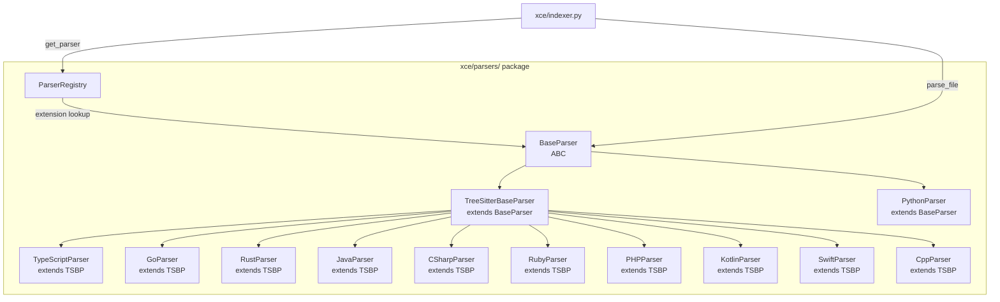

# Design Document: Multi-Language Parser Overhaul

## Overview

This design transforms XCE's parser system from two ad-hoc implementations (Python via `ast` module, TypeScript via tree-sitter script) into a unified, registry-based architecture. A `BaseParser` abstract class defines the contract. A `TreeSitterBaseParser` provides shared tree-walking logic. Each language parser is a thin subclass (~50 lines) that supplies a node-type mapping configuration. A `ParserRegistry` maps file extensions to parser instances and integrates with the indexing pipeline.

The refactoring preserves the existing Python parser's behavior (it continues using Python's `ast` module for superior accuracy) while migrating the TypeScript parser and adding 9 new languages via tree-sitter grammars.

### Key Design Decisions

1. **Python parser keeps `ast` module** — Python's built-in AST gives richer semantic info (decorators, type annotations, async detection) than tree-sitter-python. The Python parser subclasses `BaseParser` directly rather than `TreeSitterBaseParser`.
2. **Tree-sitter for everything else** — All other languages use tree-sitter grammars via `TreeSitterBaseParser`, keeping each language parser to ~50 lines of node-type mapping config.
3. **No shared mutable state** — `tree_sitter.Parser` instances are created per-call (they're cheap). Node-type mappings are frozen dataclass configs. This makes all parsers thread-safe.
4. **ASTNode.id format preserved** — `{repo_id}:{filepath}:{kind}:{name}` remains the canonical ID format across all languages.
5. **Registry is immutable after init** — Registration happens at import time; the registry is frozen before any parsing begins.

## Architecture



### Directory Structure

```
xce/parsers/
├── __init__.py              # Exports ParserRegistry, BaseParser, get_default_registry()
├── base.py                  # BaseParser ABC
├── tree_sitter_base.py      # TreeSitterBaseParser + NodeTypeMapping dataclass
├── registry.py              # ParserRegistry class
├── python_parser.py         # PythonParser (refactored from xce/parser.py)
├── typescript_parser.py     # TypeScriptParser (refactored from scripts/ts_parser.py)
├── go_parser.py             # GoParser
├── rust_parser.py           # RustParser
├── java_parser.py           # JavaParser
├── csharp_parser.py         # CSharpParser
├── ruby_parser.py           # RubyParser
├── php_parser.py            # PHPParser
├── kotlin_parser.py         # KotlinParser
├── swift_parser.py          # SwiftParser
└── cpp_parser.py            # CppParser
```

## Components and Interfaces

### BaseParser (Abstract Base Class)

```python
from abc import ABC, abstractmethod
from xce.models import ASTNode, ASTEdge

class BaseParser(ABC):
    """Abstract interface for all language parsers."""

    @abstractmethod
    def parse_file(
        self, filepath: str, source: str, repo_id: str
    ) -> tuple[list[ASTNode], list[ASTEdge]]:
        """Parse source code and return extracted nodes and edges.
        
        Args:
            filepath: Relative path of the file within the repository.
            source: Full source text of the file.
            repo_id: Repository identifier for node ID generation.
            
        Returns:
            Tuple of (nodes, edges). On error, returns partial results
            or empty lists — never raises.
        """
        ...

    @abstractmethod
    def supported_extensions(self) -> list[str]:
        """Return file extensions this parser handles (e.g., ['.py', '.pyi'])."""
        ...

    @abstractmethod
    def language_name(self) -> str:
        """Return the human-readable language name (e.g., 'python')."""
        ...
```

### NodeTypeMapping (Configuration Dataclass)

```python
from dataclasses import dataclass, field

@dataclass(frozen=True)
class NodeTypeMapping:
    """Maps tree-sitter grammar node types to XCE NodeKind values.
    
    Each field is a tuple of tree-sitter node type strings that should
    be mapped to the corresponding NodeKind.
    """
    # Node types that represent module/package declarations
    module_types: tuple[str, ...] = ()
    
    # Node types that represent class declarations
    class_types: tuple[str, ...] = ()
    
    # Node types that represent function/method declarations
    function_types: tuple[str, ...] = ()
    
    # Node types that represent import statements
    import_types: tuple[str, ...] = ()
    
    # Node types that represent variable declarations (module/class level)
    variable_types: tuple[str, ...] = ()
    
    # Node types that represent function calls
    call_types: tuple[str, ...] = ("call_expression",)
    
    # Field name used to extract the function/class name from a node
    name_field: str = "name"
    
    # Field name for function parameters
    parameters_field: str = "parameters"
    
    # Field name for class/function body
    body_field: str = "body"
    
    # Node types that indicate inheritance (e.g., extends_clause)
    inheritance_types: tuple[str, ...] = ()
    
    # Node types for decorator/annotation patterns
    decorator_types: tuple[str, ...] = ()
    
    # How to detect if a function is a method (parent node types)
    method_parent_types: tuple[str, ...] = ()
    
    # Comment node types for docstring extraction
    comment_types: tuple[str, ...] = ("comment",)
    
    # Maximum file size in bytes (skip larger files)
    max_file_size: int = 1_000_000
```

### TreeSitterBaseParser

```python
import logging
from tree_sitter import Language, Parser as TSParser

from xce.models import ASTNode, ASTEdge, NodeKind
from xce.parsers.base import BaseParser

logger = logging.getLogger(__name__)

class TreeSitterBaseParser(BaseParser):
    """Generic tree-sitter parser that uses NodeTypeMapping for language-specific behavior.
    
    Subclasses provide:
      - _get_language() -> Language
      - _get_mapping() -> NodeTypeMapping
      - supported_extensions() -> list[str]
      - language_name() -> str
    
    Optionally override:
      - _extract_name(node) -> str | None  (custom name extraction)
      - _extract_signature(node, lines) -> str | None
      - _extract_docstring(node, lines) -> str | None
    """

    @abstractmethod
    def _get_language(self) -> Language:
        """Return the tree-sitter Language object for this parser."""
        ...

    @abstractmethod
    def _get_mapping(self) -> NodeTypeMapping:
        """Return the node-type mapping configuration."""
        ...

    def parse_file(
        self, filepath: str, source: str, repo_id: str
    ) -> tuple[list[ASTNode], list[ASTEdge]]:
        mapping = self._get_mapping()
        
        if len(source.encode("utf-8")) > mapping.max_file_size:
            logger.warning("Skipping %s: exceeds max file size", filepath)
            return [], []

        # Create a fresh parser per call (thread-safe, no shared state)
        parser = TSParser()
        parser.language = self._get_language()

        try:
            tree = parser.parse(source.encode("utf-8"))
        except Exception as exc:
            logger.warning("Failed to parse %s: %s", filepath, exc)
            return [], []

        lines = source.splitlines()
        nodes: list[ASTNode] = []
        edges: list[ASTEdge] = []

        # Create module node for the file
        mod_name = _stem(filepath)
        mod_id = _make_id(repo_id, filepath, NodeKind.MODULE, mod_name)
        nodes.append(ASTNode(
            id=mod_id, kind=NodeKind.MODULE, name=mod_name,
            filepath=filepath, start_line=1, end_line=len(lines),
            source_text=source[:2000], docstring=None,
        ))

        # Walk the tree
        self._walk(tree.root_node, repo_id, filepath, lines, mod_id, nodes, edges, mapping)

        return _deduplicate(nodes, edges)

    def _walk(self, node, repo_id, filepath, lines, parent_id, nodes, edges, mapping):
        """Recursively walk tree-sitter nodes and extract declarations."""
        # ... (tree walking logic using mapping to classify nodes)
        ...
```

### ParserRegistry

```python
import logging
from typing import Optional

from xce.parsers.base import BaseParser

logger = logging.getLogger(__name__)

class ParserRegistry:
    """Maps file extensions to parser instances. Immutable after freeze()."""

    def __init__(self) -> None:
        self._ext_map: dict[str, BaseParser] = {}
        self._frozen: bool = False

    def register(self, parser: BaseParser) -> None:
        """Register a parser for its supported extensions.
        
        Raises:
            RuntimeError: If registry is frozen.
            ValueError: If an extension is already registered by another parser.
        """
        if self._frozen:
            raise RuntimeError("Cannot register parsers after registry is frozen")
        for ext in parser.supported_extensions():
            if ext in self._ext_map:
                existing = self._ext_map[ext]
                raise ValueError(
                    f"Extension '{ext}' already registered by "
                    f"{existing.language_name()}, cannot register "
                    f"{parser.language_name()}"
                )
            self._ext_map[ext] = parser

    def freeze(self) -> None:
        """Freeze the registry, preventing further registrations."""
        self._frozen = True

    def get_parser(self, filepath: str) -> Optional[BaseParser]:
        """Return the parser for a file path, or None if unsupported."""
        import os
        ext = os.path.splitext(filepath)[1].lower()
        return self._ext_map.get(ext)

    @property
    def supported_extensions(self) -> list[str]:
        """Return all registered extensions."""
        return sorted(self._ext_map.keys())

    @property
    def languages(self) -> list[str]:
        """Return all registered language names (deduplicated)."""
        return sorted(set(p.language_name() for p in self._ext_map.values()))
```

### Default Registry Factory

```python
def get_default_registry() -> ParserRegistry:
    """Create and return a fully-configured parser registry with all languages.
    
    Gracefully skips languages whose tree-sitter grammar fails to load.
    """
    registry = ParserRegistry()
    
    # Always available (uses stdlib ast)
    from xce.parsers.python_parser import PythonParser
    registry.register(PythonParser())
    
    # Tree-sitter based parsers — each wrapped in try/except
    _try_register(registry, "xce.parsers.typescript_parser", "TypeScriptParser")
    _try_register(registry, "xce.parsers.go_parser", "GoParser")
    _try_register(registry, "xce.parsers.rust_parser", "RustParser")
    _try_register(registry, "xce.parsers.java_parser", "JavaParser")
    _try_register(registry, "xce.parsers.csharp_parser", "CSharpParser")
    _try_register(registry, "xce.parsers.ruby_parser", "RubyParser")
    _try_register(registry, "xce.parsers.php_parser", "PHPParser")
    _try_register(registry, "xce.parsers.kotlin_parser", "KotlinParser")
    _try_register(registry, "xce.parsers.swift_parser", "SwiftParser")
    _try_register(registry, "xce.parsers.cpp_parser", "CppParser")
    
    registry.freeze()
    return registry


def _try_register(registry: ParserRegistry, module_path: str, class_name: str) -> None:
    """Attempt to import and register a parser, logging errors on failure."""
    try:
        import importlib
        mod = importlib.import_module(module_path)
        parser_cls = getattr(mod, class_name)
        registry.register(parser_cls())
    except Exception as exc:
        logger.error("Failed to load %s.%s: %s", module_path, class_name, exc)
```

### Python Parser Refactoring

The existing `xce/parser.py` logic moves into `xce/parsers/python_parser.py` with minimal changes:

```python
class PythonParser(BaseParser):
    """Python parser using the stdlib ast module.
    
    Preserves identical behavior to the original xce/parser.py implementation.
    """

    def supported_extensions(self) -> list[str]:
        return [".py", ".pyi"]

    def language_name(self) -> str:
        return "python"

    def parse_file(
        self, filepath: str, source: str, repo_id: str
    ) -> tuple[list[ASTNode], list[ASTEdge]]:
        # Delegates to the existing _FileVisitor logic (moved here)
        ...
```

The original `xce/parser.py` becomes a thin compatibility shim that imports from the new location, preserving backward compatibility for existing callers.

### TypeScript Parser Refactoring

The existing `scripts/ts_parser.py` is refactored into `xce/parsers/typescript_parser.py`:

```python
import tree_sitter_typescript as ts_typescript
import tree_sitter_javascript as ts_javascript
from tree_sitter import Language

class TypeScriptParser(TreeSitterBaseParser):
    """TypeScript/JavaScript parser via tree-sitter."""

    def _get_language(self) -> Language:
        # Returns appropriate language based on file extension
        # (handled via per-file dispatch in parse_file override)
        return Language(ts_typescript.language_typescript())

    def _get_mapping(self) -> NodeTypeMapping:
        return NodeTypeMapping(
            class_types=("class_declaration",),
            function_types=("function_declaration", "arrow_function", "method_definition"),
            import_types=("import_statement",),
            variable_types=("lexical_declaration",),
            inheritance_types=("extends_clause",),
            method_parent_types=("class_body",),
            comment_types=("comment",),
        )

    def supported_extensions(self) -> list[str]:
        return [".ts", ".tsx", ".js", ".jsx"]

    def language_name(self) -> str:
        return "typescript"

    def parse_file(self, filepath: str, source: str, repo_id: str):
        # Override to select correct Language (TS vs TSX vs JS) based on extension
        ...
```

### Example Language Parser: Go

```python
import tree_sitter_go as ts_go
from tree_sitter import Language

class GoParser(TreeSitterBaseParser):
    """Go parser via tree-sitter."""

    def _get_language(self) -> Language:
        return Language(ts_go.language())

    def _get_mapping(self) -> NodeTypeMapping:
        return NodeTypeMapping(
            module_types=("package_clause",),
            class_types=("type_declaration",),  # structs, interfaces
            function_types=("function_declaration", "method_declaration"),
            import_types=("import_declaration",),
            variable_types=("var_declaration", "const_declaration"),
            call_types=("call_expression",),
            name_field="name",
            parameters_field="parameters",
            body_field="body",
            method_parent_types=("type_declaration",),
        )

    def supported_extensions(self) -> list[str]:
        return [".go"]

    def language_name(self) -> str:
        return "go"
```

### Node-Type Mappings for All Languages

| Language | class_types | function_types | import_types | Extensions |
|----------|-------------|----------------|--------------|------------|
| **Go** | `type_declaration` | `function_declaration`, `method_declaration` | `import_declaration` | `.go` |
| **Rust** | `struct_item`, `enum_item`, `trait_item`, `impl_item` | `function_item` | `use_declaration` | `.rs` |
| **Java** | `class_declaration`, `interface_declaration` | `method_declaration`, `constructor_declaration` | `import_declaration` | `.java` |
| **C#** | `class_declaration`, `interface_declaration`, `struct_declaration` | `method_declaration`, `constructor_declaration` | `using_directive` | `.cs` |
| **Ruby** | `class`, `module` | `method`, `singleton_method` | `call` (require/require_relative) | `.rb` |
| **PHP** | `class_declaration`, `interface_declaration`, `trait_declaration` | `function_definition`, `method_declaration` | `namespace_use_declaration` | `.php` |
| **Kotlin** | `class_declaration`, `interface_declaration`, `object_declaration` | `function_declaration` | `import_header` | `.kt`, `.kts` |
| **Swift** | `class_declaration`, `struct_declaration`, `protocol_declaration` | `function_declaration` | `import_declaration` | `.swift` |
| **C/C++** | `class_specifier`, `struct_specifier` | `function_definition`, `declaration` | `preproc_include` | `.c`, `.cpp`, `.cc`, `.cxx`, `.h`, `.hpp` |

## Data Models

### Existing Models (Unchanged)

The `ASTNode`, `ASTEdge`, and `NodeKind` dataclasses in `xce/models.py` remain unchanged. All parsers produce instances of these exact types.

### New Configuration Model

```python
@dataclass(frozen=True)
class NodeTypeMapping:
    """Immutable configuration mapping tree-sitter node types to XCE kinds."""
    module_types: tuple[str, ...] = ()
    class_types: tuple[str, ...] = ()
    function_types: tuple[str, ...] = ()
    import_types: tuple[str, ...] = ()
    variable_types: tuple[str, ...] = ()
    call_types: tuple[str, ...] = ("call_expression",)
    name_field: str = "name"
    parameters_field: str = "parameters"
    body_field: str = "body"
    inheritance_types: tuple[str, ...] = ()
    decorator_types: tuple[str, ...] = ()
    method_parent_types: tuple[str, ...] = ()
    comment_types: tuple[str, ...] = ("comment",)
    max_file_size: int = 1_000_000
```

### Dependency Additions (pyproject.toml)

```toml
dependencies = [
    # ... existing deps ...
    "tree-sitter>=0.22",
    "tree-sitter-python>=0.23",
    "tree-sitter-typescript>=0.23",
    "tree-sitter-javascript>=0.23",
    "tree-sitter-go>=0.23",
    "tree-sitter-rust>=0.23",
    "tree-sitter-java>=0.23",
    "tree-sitter-c-sharp>=0.23",
    "tree-sitter-ruby>=0.23",
    "tree-sitter-php>=0.23",
    "tree-sitter-kotlin>=0.23",
    "tree-sitter-swift>=0.23",
    "tree-sitter-c>=0.23",
    "tree-sitter-cpp>=0.23",
]
```

License field change: `license = "AGPL-3.0-or-later"`

## Correctness Properties

*A property is a characteristic or behavior that should hold true across all valid executions of a system — essentially, a formal statement about what the system should do. Properties serve as the bridge between human-readable specifications and machine-verifiable correctness guarantees.*

### Property 1: Registry extension round-trip

*For any* set of parsers with non-overlapping extensions, after registering all parsers, calling `get_parser(filepath)` for any filepath whose extension was registered SHALL return the exact parser instance that declared that extension.

**Validates: Requirements 1.4, 1.6, 10.1**

### Property 2: Registry duplicate detection

*For any* two parsers that share at least one file extension, registering the second parser SHALL raise a `ValueError` before the registry state is modified.

**Validates: Requirements 1.5**

### Property 3: Registry returns None for unknown extensions

*For any* filepath whose extension is not in the set of registered extensions, `get_parser(filepath)` SHALL return `None`.

**Validates: Requirements 1.7, 10.3**

### Property 4: ASTNode ID format invariant

*For any* source file parsed by any registered parser, every `ASTNode.id` in the output SHALL match the pattern `{repo_id}:{filepath}:{kind_value}:{name}` where `kind_value` is a valid `NodeKind` enum value string.

**Validates: Requirements 6.1, 2.5**

### Property 5: Output type validity

*For any* source file parsed by any registered parser, every `ASTNode.kind` SHALL be a member of the `NodeKind` enum, AND every `ASTEdge.relation` SHALL be one of: "contains", "calls", "imports", "inherits", "decorates".

**Validates: Requirements 6.2, 2.6**

### Property 6: Module node invariant

*For any* non-empty source string parsed by any registered parser, the output SHALL contain at least one `ASTNode` with `kind == NodeKind.MODULE`.

**Validates: Requirements 6.3**

### Property 7: Python parser backward compatibility

*For any* valid Python source file, the refactored `PythonParser.parse_file()` SHALL produce an identical set of `ASTNode` and `ASTEdge` instances (compared by all fields) as the original `xce/parser.py` `ASTParser.parse_file()`.

**Validates: Requirements 3.3**

### Property 8: Graceful error handling (no exceptions)

*For any* byte string (including invalid/malformed source code), calling `parse_file()` on any registered parser SHALL return a `tuple[list[ASTNode], list[ASTEdge]]` without raising an exception.

**Validates: Requirements 3.4, 4.4, 7.1**

### Property 9: File size limit enforcement

*For any* source string whose UTF-8 encoded length exceeds 1,000,000 bytes, calling `parse_file()` on any `TreeSitterBaseParser` subclass SHALL return `([], [])`.

**Validates: Requirements 7.3**

### Property 10: Thread-safety (concurrent parsing determinism)

*For any* source file and any parser, parsing the same file N times concurrently from different threads SHALL produce identical results to parsing it N times sequentially.

**Validates: Requirements 8.1, 8.2**

## Error Handling

### Strategy

All error handling follows the principle: **never let a single file break the pipeline**. Errors are logged and the parser returns partial or empty results.

| Error Scenario | Handler | Behavior |
|---|---|---|
| Syntax error in source | `TreeSitterBaseParser.parse_file` | tree-sitter produces partial tree; extract what's available |
| Grammar fails to load | `get_default_registry()` / `_try_register` | Log error, skip language, registry works for others |
| File exceeds 1MB | `TreeSitterBaseParser.parse_file` | Log warning, return `([], [])` |
| Encoding error (file read) | Indexer layer | Log warning, skip file |
| Duplicate extension registration | `ParserRegistry.register` | Raise `ValueError` at startup (fail-fast) |
| Registration after freeze | `ParserRegistry.register` | Raise `RuntimeError` (programming error) |
| Unknown exception during parse | `TreeSitterBaseParser.parse_file` | Catch-all, log error, return `([], [])` |

### Logging

All parsers use `logging.getLogger(__name__)` for structured logging:
- `WARNING` — file skipped (size, encoding, syntax error)
- `ERROR` — grammar load failure, unexpected exception
- `DEBUG` — per-file parse timing, node counts

## Testing Strategy

### Property-Based Tests (Hypothesis)

The project already has `hypothesis>=6.100` in dev dependencies. Each correctness property maps to a single property-based test with minimum 100 iterations.

**Library**: `hypothesis` (already in `pyproject.toml` dev deps)
**Configuration**: `@settings(max_examples=100)`
**Tag format**: `# Feature: multi-language-parser-overhaul, Property N: <title>`

**Generators needed**:
- `st_repo_id`: `st.text(alphabet=st.characters(whitelist_categories=('L', 'N')), min_size=1, max_size=20)`
- `st_filepath`: Generate paths like `src/module.py` with valid extensions
- `st_python_source`: Use `hypothesis` text strategy filtered through `ast.parse` for valid Python, or raw text for error-handling tests
- `st_extensions`: Random file extensions (`.xyz`, `.abc`) for unknown-extension tests
- `st_parser_set`: Generate sets of mock parsers with non-overlapping extensions

### Unit Tests (pytest)

Unit tests cover:
- Each language parser with representative source files (1-2 files per language)
- Interface compliance (all parsers implement BaseParser)
- Registry configuration (all expected extensions registered)
- Edge cases: empty files, files with only comments, single-line files

### Integration Tests

- End-to-end: index a small multi-language repo, verify graph contains nodes from all languages
- Backward compatibility: run old `ASTParser` and new `PythonParser` on the same test corpus, diff outputs

### Test File Organization

```
tests/
├── parsers/
│   ├── __init__.py
│   ├── test_registry.py          # Registry unit + property tests
│   ├── test_base_parser.py       # BaseParser interface tests
│   ├── test_python_parser.py     # Python parser + backward compat property
│   ├── test_typescript_parser.py # TypeScript parser tests
│   ├── test_go_parser.py         # Go parser tests
│   ├── test_rust_parser.py       # Rust parser tests
│   ├── test_java_parser.py       # Java parser tests
│   ├── test_csharp_parser.py     # C# parser tests
│   ├── test_ruby_parser.py       # Ruby parser tests
│   ├── test_php_parser.py        # PHP parser tests
│   ├── test_kotlin_parser.py     # Kotlin parser tests
│   ├── test_swift_parser.py      # Swift parser tests
│   ├── test_cpp_parser.py        # C/C++ parser tests
│   ├── test_thread_safety.py     # Concurrent parsing property test
│   └── fixtures/                 # Sample source files per language
│       ├── sample.py
│       ├── sample.ts
│       ├── sample.go
│       ├── sample.rs
│       ├── sample.java
│       ├── sample.cs
│       ├── sample.rb
│       ├── sample.php
│       ├── sample.kt
│       ├── sample.swift
│       ├── sample.cpp
│       └── sample.h
```

## Open Source File Additions

| File | Purpose |
|------|---------|
| `LICENSE` | Full AGPL-3.0 license text |
| `COMMERCIAL_LICENSE.md` | Dual licensing explanation — commercial license available for proprietary use |
| `CONTRIBUTING.md` | Contribution guidelines: PR process, code style, testing requirements |
| `.env.example` | All required env vars with placeholder values and descriptions |

### .env.example Contents

```env
# Neo4j connection
NEO4J_URI=bolt://localhost:7687
NEO4J_USER=neo4j
NEO4J_PASSWORD=your-password-here

# OpenAI API (for embeddings and doc generation)
OPENAI_API_KEY=sk-your-key-here
OPENAI_MODEL=gpt-4o-mini

# Server configuration
HOST=0.0.0.0
PORT=8000
LOG_LEVEL=info
```

