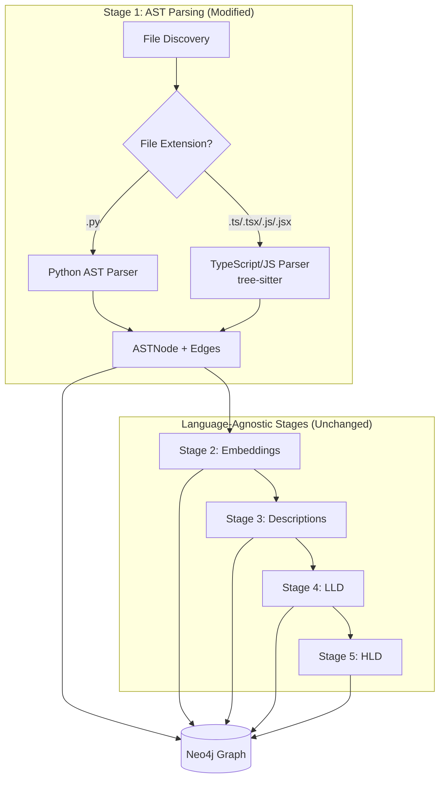
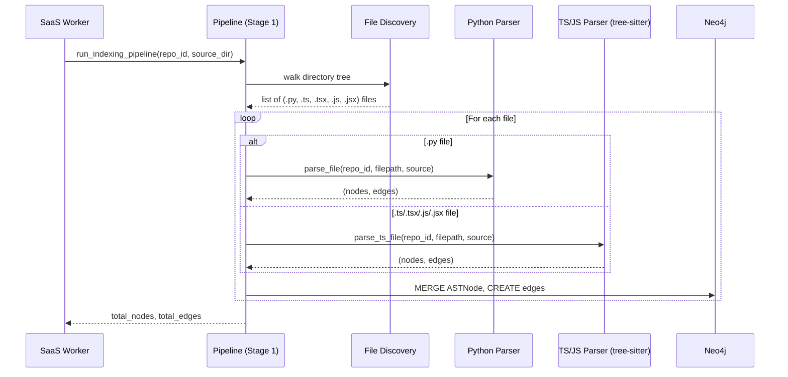
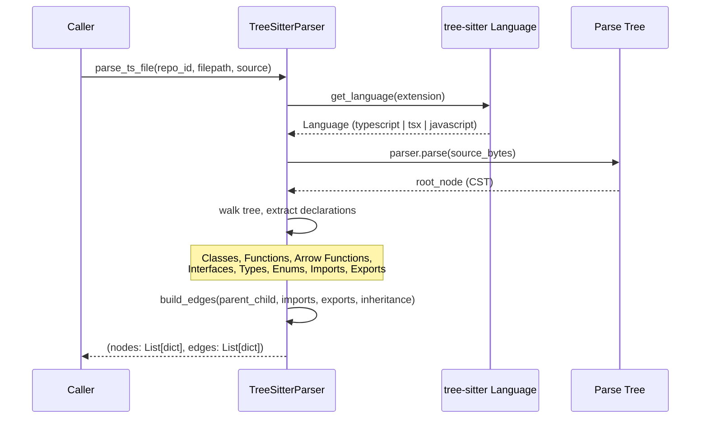

# Design Document: TypeScript/JavaScript Indexing Support

## Overview

This feature extends the XCE indexing pipeline to support TypeScript and JavaScript repositories alongside the existing Python support. The pipeline currently uses Python's `ast` module for parsing `.py` files into a graph of `ASTNode` entities stored in Neo4j. This design adds a parallel parsing path using `tree-sitter` (via Python bindings) to extract the same node types — modules, classes, functions, interfaces, types, enums, imports, and exports — from `.ts`, `.tsx`, `.js`, and `.jsx` files.

The key design principle is that Stages 2–5 (embeddings, descriptions, LLD, HLD) are language-agnostic. They operate on `ASTNode` graph nodes regardless of source language. Therefore, the only structural changes are in Stage 1 (AST parsing) and the SaaS worker's file discovery logic. The TypeScript parser must produce nodes and edges in the identical schema so downstream stages work without modification.

## Architecture



## Sequence Diagrams

### Main Indexing Flow (Stage 1)



### Tree-Sitter Parsing Detail



## Components and Interfaces

### Component 1: TypeScriptParser

**Purpose**: Parses TypeScript/JavaScript files using tree-sitter and extracts AST nodes and relationships in the same schema as the Python parser.

**Interface**:
```python
class TypeScriptParser:
    def __init__(self) -> None:
        """Initialize tree-sitter parsers for TS, TSX, JS, JSX."""
        ...

    def parse_file(self, repo_id: str, filepath: str, source: str) -> tuple[list[dict], list[dict]]:
        """Parse a single TS/JS file and return (nodes, edges)."""
        ...

    def _get_language(self, filepath: str) -> Language:
        """Determine tree-sitter language from file extension."""
        ...

    def _extract_classes(self, root_node, repo_id: str, filepath: str, lines: list[str]) -> tuple[list[dict], list[dict]]:
        """Extract class declarations and their methods."""
        ...

    def _extract_functions(self, root_node, repo_id: str, filepath: str, lines: list[str]) -> tuple[list[dict], list[dict]]:
        """Extract function declarations and arrow function assignments."""
        ...

    def _extract_interfaces(self, root_node, repo_id: str, filepath: str, lines: list[str]) -> tuple[list[dict], list[dict]]:
        """Extract interface and type alias declarations."""
        ...

    def _extract_enums(self, root_node, repo_id: str, filepath: str, lines: list[str]) -> tuple[list[dict], list[dict]]:
        """Extract enum declarations."""
        ...

    def _extract_imports(self, root_node, repo_id: str, filepath: str, lines: list[str]) -> tuple[list[dict], list[dict]]:
        """Extract import statements."""
        ...

    def _extract_exports(self, root_node, repo_id: str, filepath: str, lines: list[str]) -> tuple[list[dict], list[dict]]:
        """Extract export statements and re-exports."""
        ...
```

**Responsibilities**:
- Initialize and manage tree-sitter parser instances for each language variant
- Walk the concrete syntax tree (CST) to find declaration nodes
- Extract source text, signatures, and documentation (JSDoc comments)
- Build node IDs consistent with the existing `{repo_id}:{filepath}:{kind}:{name}` format
- Handle TypeScript-specific constructs: generics, decorators, type annotations

### Component 2: FileDiscovery (Modified)

**Purpose**: Extended file discovery that finds both Python and TypeScript/JavaScript files.

**Interface**:
```python
def discover_source_files(repo_path: str) -> dict[str, list[str]]:
    """Walk repo and return files grouped by language.
    
    Returns:
        {"python": [list of .py paths], "typescript": [list of .ts/.tsx/.js/.jsx paths]}
    """
    ...
```

**Responsibilities**:
- Walk directory tree, skipping hidden dirs, `node_modules`, `__pycache__`, `dist`, `build`
- Classify files by extension into language groups
- Return relative paths for each file

### Component 3: Stage1 Orchestrator (Modified)

**Purpose**: Coordinates parsing across both Python and TypeScript/JavaScript parsers.

**Interface**:
```python
def stage1_ast(repo_id: str, source_dir: str) -> None:
    """Parse all supported source files and store nodes/edges in Neo4j.
    
    Now handles .py, .ts, .tsx, .js, .jsx files.
    """
    ...
```

**Responsibilities**:
- Discover all source files (Python + TS/JS)
- Route each file to the appropriate parser
- Batch-write nodes and edges to Neo4j
- Report progress for both language groups

## Data Models

### ASTNode (Existing — No Changes)

```python
ASTNode = {
    "id": str,           # "{repo_id}:{filepath}:{kind}:{name}"
    "kind": str,         # "module" | "class" | "function" | "interface" | "type_alias" | "enum" | "import" | "export"
    "name": str,         # Declaration name
    "filepath": str,     # Relative path within repo
    "start_line": int,   # 1-indexed
    "end_line": int,     # 1-indexed
    "source_text": str,  # First 1000 chars of source
    "docstring": str | None,  # JSDoc or Python docstring
    "signature": str | None,  # Function signature string
    "repo_id": str,      # Repository identifier
    "language": str,     # NEW FIELD: "python" | "typescript" | "javascript"
}
```

**New `kind` values for TypeScript/JavaScript**:
- `"interface"` — TypeScript interface declarations
- `"type_alias"` — TypeScript type alias declarations (`type Foo = ...`)
- `"enum"` — TypeScript/JavaScript enum declarations
- `"export"` — Named or default export declarations

**Validation Rules**:
- `id` must be unique within a repo
- `kind` must be one of the allowed values
- `filepath` must be a relative path (no leading `/`)
- `source_text` truncated to 1000 characters
- `language` field added to distinguish source language for downstream stages

### Edge Relations (Existing + New)

```python
EdgeRelation = "CONTAINS" | "INHERITS" | "IMPLEMENTS" | "EXPORTS" | "IMPORTS_FROM"
```

| Relation | Source | Target | Description |
|----------|--------|--------|-------------|
| CONTAINS | module | class/function/interface/enum | Parent contains child |
| CONTAINS | class | function (method) | Class contains method |
| INHERITS | class | class | `extends` relationship |
| IMPLEMENTS | class | interface | `implements` relationship (NEW) |
| EXPORTS | module | class/function/interface | Module exports declaration (NEW) |
| IMPORTS_FROM | import | module | Import references source module (NEW) |

## Algorithmic Pseudocode

### Main Parsing Algorithm

```python
def parse_ts_file(repo_id: str, filepath: str, source: str) -> tuple[list[dict], list[dict]]:
    """
    Parse a TypeScript/JavaScript file using tree-sitter.
    
    Preconditions:
        - repo_id is non-empty string
        - filepath is relative path ending in .ts/.tsx/.js/.jsx
        - source is valid UTF-8 string
    
    Postconditions:
        - Returns (nodes, edges) where each node has all required ASTNode fields
        - Module node is always first in nodes list
        - All edge source_ids and target_ids reference valid node ids
        - No duplicate node ids in returned list
    
    Loop Invariants:
        - nodes list contains only well-formed ASTNode dicts
        - edges list contains only edges referencing nodes in the nodes list
    """
    # Step 1: Determine language from extension
    language = get_language_for_extension(filepath)
    
    # Step 2: Parse source into CST
    tree = parser.parse(source.encode("utf-8"), language)
    root = tree.root_node
    lines = source.splitlines()
    
    # Step 3: Create module node (always present)
    mod_name = os.path.basename(filepath).rsplit(".", 1)[0]
    mod_id = f"{repo_id}:{filepath}:module:{mod_name}"
    nodes = [make_module_node(mod_id, mod_name, filepath, lines, repo_id, language)]
    edges = []
    
    # Step 4: Walk top-level declarations
    for child in root.children:
        node_type = child.type
        
        if node_type == "class_declaration":
            cls_nodes, cls_edges = extract_class(child, repo_id, filepath, lines, mod_id)
            nodes.extend(cls_nodes)
            edges.extend(cls_edges)
            
        elif node_type in ("function_declaration", "lexical_declaration"):
            fn_nodes, fn_edges = extract_function(child, repo_id, filepath, lines, mod_id)
            nodes.extend(fn_nodes)
            edges.extend(fn_edges)
            
        elif node_type == "interface_declaration":
            iface_nodes, iface_edges = extract_interface(child, repo_id, filepath, lines, mod_id)
            nodes.extend(iface_nodes)
            edges.extend(iface_edges)
            
        elif node_type == "type_alias_declaration":
            type_nodes, type_edges = extract_type_alias(child, repo_id, filepath, lines, mod_id)
            nodes.extend(type_nodes)
            edges.extend(type_edges)
            
        elif node_type == "enum_declaration":
            enum_nodes, enum_edges = extract_enum(child, repo_id, filepath, lines, mod_id)
            nodes.extend(enum_nodes)
            edges.extend(enum_edges)
            
        elif node_type == "import_statement":
            imp_nodes, imp_edges = extract_import(child, repo_id, filepath, lines, mod_id)
            nodes.extend(imp_nodes)
            edges.extend(imp_edges)
            
        elif node_type == "export_statement":
            exp_nodes, exp_edges = extract_export(child, repo_id, filepath, lines, mod_id)
            nodes.extend(exp_nodes)
            edges.extend(exp_edges)
    
    return nodes, edges
```

### Arrow Function Detection Algorithm

```python
def extract_function(node, repo_id: str, filepath: str, lines: list[str], mod_id: str) -> tuple[list[dict], list[dict]]:
    """
    Extract function declarations AND arrow function variable assignments.
    
    Handles:
        - function foo() {}
        - async function foo() {}
        - const foo = () => {}
        - const foo = async () => {}
        - export function foo() {}
        - export const foo = () => {}
    
    Preconditions:
        - node is a tree-sitter Node of type function_declaration or lexical_declaration
        - mod_id references a valid module node
    
    Postconditions:
        - Returns function nodes with kind="function"
        - Each function node has a signature string
        - CONTAINS edge from mod_id to each function node
    """
    nodes, edges = [], []
    
    if node.type == "function_declaration":
        # Direct function declaration: function foo(a, b) {}
        name = get_child_by_field(node, "name").text.decode()
        params = get_child_by_field(node, "parameters").text.decode()
        is_async = any(c.type == "async" for c in node.children)
        prefix = "async function" if is_async else "function"
        signature = f"{prefix} {name}{params}"
        
        nid = f"{repo_id}:{filepath}:function:{name}"
        nodes.append(make_function_node(nid, name, filepath, node, lines, signature, repo_id))
        edges.append({"source_id": mod_id, "target_id": nid, "relation": "CONTAINS"})
        
    elif node.type == "lexical_declaration":
        # Check for arrow function: const foo = (...) => {}
        for declarator in find_children_by_type(node, "variable_declarator"):
            name_node = get_child_by_field(declarator, "name")
            value_node = get_child_by_field(declarator, "value")
            
            if value_node and value_node.type == "arrow_function":
                name = name_node.text.decode()
                params = get_child_by_field(value_node, "parameters")
                params_text = params.text.decode() if params else "()"
                is_async = any(c.type == "async" for c in value_node.children)
                prefix = "async " if is_async else ""
                signature = f"const {name} = {prefix}{params_text} =>"
                
                nid = f"{repo_id}:{filepath}:function:{name}"
                nodes.append(make_function_node(nid, name, filepath, declarator, lines, signature, repo_id))
                edges.append({"source_id": mod_id, "target_id": nid, "relation": "CONTAINS"})
    
    return nodes, edges
```

### Class Extraction with Inheritance

```python
def extract_class(node, repo_id: str, filepath: str, lines: list[str], mod_id: str) -> tuple[list[dict], list[dict]]:
    """
    Extract class declaration with methods, inheritance, and implements.
    
    Preconditions:
        - node.type == "class_declaration"
    
    Postconditions:
        - Returns class node + method nodes
        - CONTAINS edges from module to class, class to methods
        - INHERITS edge if extends clause present
        - IMPLEMENTS edges if implements clause present
    """
    nodes, edges = [], []
    
    name = get_child_by_field(node, "name").text.decode()
    nid = f"{repo_id}:{filepath}:class:{name}"
    
    # Extract JSDoc from preceding comment
    docstring = extract_jsdoc(node, lines)
    
    nodes.append({
        "id": nid, "kind": "class", "name": name, "filepath": filepath,
        "start_line": node.start_point[0] + 1,
        "end_line": node.end_point[0] + 1,
        "source_text": get_source_text(node, lines)[:1000],
        "docstring": docstring, "signature": None,
        "repo_id": repo_id, "language": get_language_name(filepath),
    })
    edges.append({"source_id": mod_id, "target_id": nid, "relation": "CONTAINS"})
    
    # Handle extends (inheritance)
    heritage = get_child_by_field(node, "heritage")
    if heritage:
        for clause in find_children_by_type(heritage, "extends_clause"):
            base_name = get_first_identifier(clause)
            if base_name:
                edges.append({
                    "source_id": nid,
                    "target_id": f"{repo_id}:{filepath}:class:{base_name}",
                    "relation": "INHERITS",
                })
        for clause in find_children_by_type(heritage, "implements_clause"):
            for iface_name in get_all_identifiers(clause):
                edges.append({
                    "source_id": nid,
                    "target_id": f"{repo_id}:{filepath}:interface:{iface_name}",
                    "relation": "IMPLEMENTS",
                })
    
    # Extract methods
    body = get_child_by_field(node, "body")
    if body:
        for method in find_children_by_type(body, "method_definition"):
            method_name = get_child_by_field(method, "name").text.decode()
            method_id = f"{repo_id}:{filepath}:function:{name}.{method_name}"
            params = get_child_by_field(method, "parameters").text.decode()
            signature = f"{method_name}{params}"
            
            nodes.append(make_function_node(method_id, f"{name}.{method_name}", filepath, method, lines, signature, repo_id))
            edges.append({"source_id": nid, "target_id": method_id, "relation": "CONTAINS"})
    
    return nodes, edges
```

## Key Functions with Formal Specifications

### `get_language_for_extension(filepath: str) -> Language`

```python
def get_language_for_extension(filepath: str) -> Language:
    """Map file extension to tree-sitter Language object."""
    ...
```

**Preconditions:**
- `filepath` is a non-empty string with a file extension

**Postconditions:**
- Returns a valid tree-sitter `Language` object
- `.ts` → TypeScript language
- `.tsx` → TSX language
- `.js` / `.jsx` → JavaScript language
- Raises `ValueError` for unsupported extensions

### `extract_jsdoc(node, lines: list[str]) -> str | None`

```python
def extract_jsdoc(node, lines: list[str]) -> str | None:
    """Extract JSDoc comment preceding a declaration node."""
    ...
```

**Preconditions:**
- `node` is a tree-sitter Node
- `lines` is the source file split by newlines

**Postconditions:**
- Returns the JSDoc text (without `/**` and `*/` markers) if a JSDoc comment immediately precedes the node
- Returns `None` if no JSDoc comment found
- Strips leading `*` from each line of the JSDoc body

### `make_function_node(nid, name, filepath, node, lines, signature, repo_id) -> dict`

```python
def make_function_node(nid: str, name: str, filepath: str, node, lines: list[str], signature: str, repo_id: str) -> dict:
    """Construct a well-formed ASTNode dict for a function."""
    ...
```

**Preconditions:**
- All string parameters are non-empty
- `node` has valid `start_point` and `end_point` attributes

**Postconditions:**
- Returns dict with all required ASTNode fields
- `source_text` is truncated to 1000 characters
- `start_line` and `end_line` are 1-indexed (tree-sitter uses 0-indexed)
- `language` field is set based on file extension

### `discover_source_files(repo_path: str) -> dict[str, list[str]]`

```python
def discover_source_files(repo_path: str) -> dict[str, list[str]]:
    """Walk repo directory and return source files grouped by language."""
    ...
```

**Preconditions:**
- `repo_path` is a valid directory path

**Postconditions:**
- Returns dict with keys `"python"` and `"typescript"`
- All paths are relative to `repo_path`
- Excludes files in: `.git`, `node_modules`, `__pycache__`, `dist`, `build`, `.next`, `coverage`
- Python list contains only `.py` files
- TypeScript list contains `.ts`, `.tsx`, `.js`, `.jsx` files (excluding `.d.ts` declaration files)

**Loop Invariants:**
- Skipped directories are never descended into
- Each file appears in exactly one language group

## Example Usage

```python
from ts_parser import TypeScriptParser

# Initialize parser (loads tree-sitter grammars)
ts_parser = TypeScriptParser()

# Parse a single TypeScript file
source = '''
import { useState } from 'react';

interface UserProps {
  name: string;
  age: number;
}

const UserCard: React.FC<UserProps> = ({ name, age }) => {
  const [expanded, setExpanded] = useState(false);
  return <div>{name} ({age})</div>;
};

export default UserCard;
'''

nodes, edges = ts_parser.parse_file("lobehub-lobe-chat", "src/components/UserCard.tsx", source)

# nodes will contain:
# - module node: "lobehub-lobe-chat:src/components/UserCard.tsx:module:UserCard"
# - interface node: "lobehub-lobe-chat:src/components/UserCard.tsx:interface:UserProps"
# - function node: "lobehub-lobe-chat:src/components/UserCard.tsx:function:UserCard"
# - import node: "lobehub-lobe-chat:src/components/UserCard.tsx:import:useState"

# edges will contain:
# - CONTAINS: module -> interface
# - CONTAINS: module -> function
# - CONTAINS: module -> import
# - EXPORTS: module -> function (default export)
```

```python
# Integration with existing pipeline (modified stage1_ast)
def stage1_ast(repo_id: str, source_dir: str) -> None:
    repo_path = os.path.join(source_dir, repo_id)
    files = discover_source_files(repo_path)
    
    ts_parser = TypeScriptParser()
    
    # Parse Python files (existing logic)
    for filepath in files["python"]:
        source = read_file(os.path.join(repo_path, filepath))
        nodes, edges = parse_file(repo_id, filepath, source)  # existing Python parser
        write_to_neo4j(nodes, edges)
    
    # Parse TypeScript/JavaScript files (new)
    for filepath in files["typescript"]:
        source = read_file(os.path.join(repo_path, filepath))
        nodes, edges = ts_parser.parse_file(repo_id, filepath, source)
        write_to_neo4j(nodes, edges)  # same Neo4j write logic
```

## Correctness Properties

1. **Schema Compatibility**: For all nodes produced by `TypeScriptParser.parse_file()`, the node dict contains exactly the same keys as nodes produced by the Python `parse_file()` function, plus the `language` field.

2. **ID Uniqueness**: For any repo, no two nodes share the same `id`. The format `{repo_id}:{filepath}:{kind}:{name}` guarantees uniqueness within a file; qualified names (`ClassName.methodName`) prevent collisions between methods and top-level functions.

3. **Edge Validity**: For all edges `(source_id, target_id, relation)` produced by the parser, both `source_id` and `target_id` reference nodes that exist in the returned nodes list OR follow the cross-file reference pattern (for imports/inheritance referencing other files).

4. **Completeness**: Every top-level declaration in a TypeScript/JavaScript file (class, function, arrow function assignment, interface, type alias, enum, import, export) produces at least one node.

5. **Idempotency**: Running Stage 1 twice on the same file produces the same graph state (MERGE semantics in Neo4j ensure no duplicates).

6. **Language Agnosticism of Downstream Stages**: Stages 2–5 operate on `ASTNode` nodes without checking the `language` field. Any node with `kind in ['class', 'function']` and sufficient `source_text` will be processed by Stages 3–5.

## Error Handling

### Error Scenario 1: Parse Failure (Syntax Error)

**Condition**: tree-sitter encounters a file it cannot parse (e.g., malformed syntax, binary file misidentified)
**Response**: Log a warning with the filepath, return empty `([], [])` — same behavior as the Python parser's `SyntaxError` handling
**Recovery**: Pipeline continues with next file; no partial nodes written

### Error Scenario 2: Missing tree-sitter Grammar

**Condition**: tree-sitter language library not installed or not found at runtime
**Response**: Raise `RuntimeError` at `TypeScriptParser.__init__()` with clear message about missing dependency
**Recovery**: Pipeline fails fast before processing any files; operator installs the grammar

### Error Scenario 3: Very Large Files

**Condition**: Source file exceeds 1MB (e.g., bundled/minified files)
**Response**: Skip file with a warning log; do not attempt to parse
**Recovery**: Pipeline continues; these files are not useful for indexing anyway

### Error Scenario 4: Unsupported Node Types

**Condition**: tree-sitter returns node types not handled by the extraction logic (e.g., decorators, ambient declarations)
**Response**: Silently skip unrecognized node types; only extract known declaration types
**Recovery**: No action needed; the parser is intentionally selective

## Testing Strategy

### Unit Testing Approach

- Test each extraction function (`extract_class`, `extract_function`, etc.) with representative TypeScript/JavaScript snippets
- Verify node schema compliance (all required fields present, correct types)
- Verify edge correctness (valid source/target IDs, correct relation types)
- Test edge cases: empty files, files with only imports, deeply nested classes

**Key test cases**:
- Arrow function with type annotations
- Class with extends and implements
- Re-export statements (`export { foo } from './bar'`)
- Default exports of anonymous functions
- Destructured imports
- Generic type parameters
- React functional components (arrow function with JSX return)

### Property-Based Testing Approach

**Property Test Library**: `hypothesis` (Python)

Properties to test:
- For any valid TypeScript source string, `parse_file()` returns `(nodes, edges)` where `len(nodes) >= 1` (module node always present)
- For any returned edge, `edge["source_id"]` appears in the nodes list
- All node IDs match the pattern `{repo_id}:{filepath}:{kind}:{name}`
- `source_text` length never exceeds 1000 characters
- `start_line <= end_line` for all nodes

### Integration Testing Approach

- Clone a real TypeScript repo (e.g., a small subset of lobe-chat) and run the full pipeline
- Verify nodes appear in Neo4j with correct properties
- Verify Stages 2–5 process TypeScript nodes without errors
- Compare node counts against manual inspection of a known file

## Performance Considerations

- **tree-sitter parsing is fast**: ~10ms per file for typical source files (C-based parser)
- **File discovery**: Skip `node_modules` early to avoid walking thousands of dependency files
- **Large repos**: lobe-chat has ~2000 TS/TSX files; at 10ms/file, Stage 1 completes in ~20 seconds
- **Memory**: tree-sitter trees are lightweight; no concern for repos under 10K files
- **Neo4j writes**: Batch MERGE operations (same as Python path) — 500 files per progress log

## Security Considerations

- **No code execution**: tree-sitter only parses; it never evaluates or executes source code
- **Source text truncation**: `source_text` capped at 1000 chars prevents storing excessively large blobs
- **File size limit**: Skip files > 1MB to prevent memory issues from bundled/minified code
- **Path traversal**: All paths are relative; `os.path.relpath()` ensures no absolute paths stored

## Dependencies

| Dependency | Version | Purpose |
|-----------|---------|---------|
| `tree-sitter` | ≥0.21.0 | Core parsing library (Python bindings) |
| `tree-sitter-typescript` | ≥0.21.0 | TypeScript + TSX grammar |
| `tree-sitter-javascript` | ≥0.21.0 | JavaScript grammar |

**Installation on EC2 (Ubuntu, Python 3.10)**:
```bash
pip install tree-sitter tree-sitter-typescript tree-sitter-javascript
```

No Node.js runtime required — tree-sitter's Python bindings include pre-compiled grammars.
