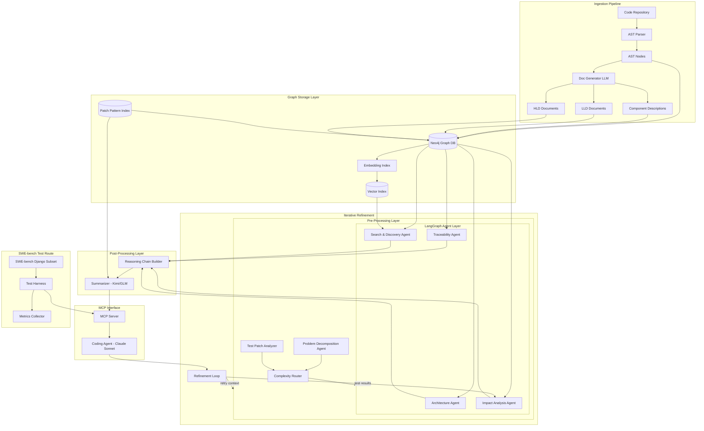
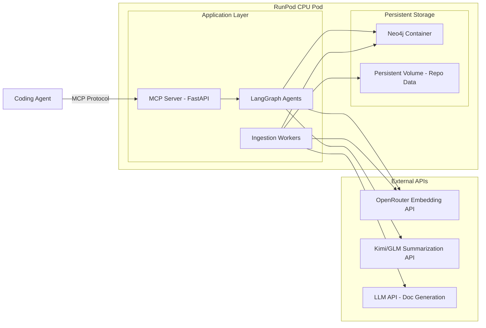
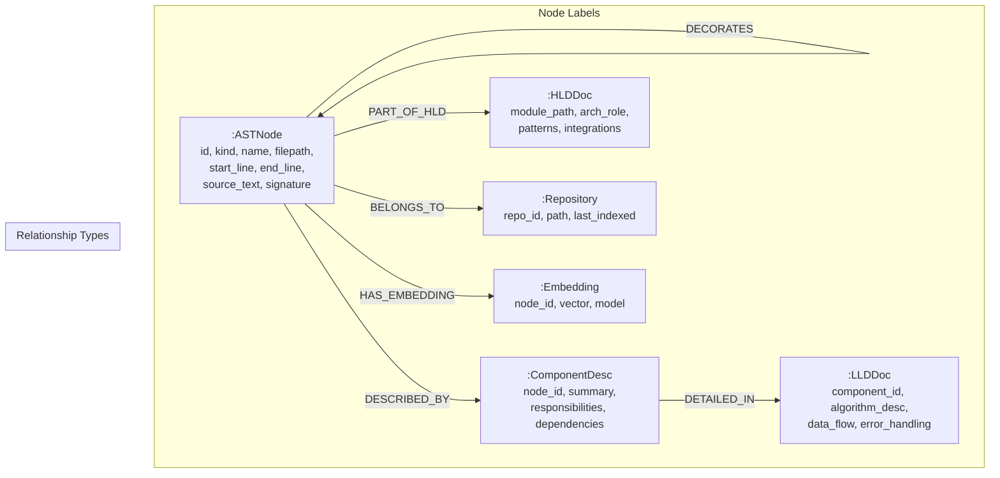
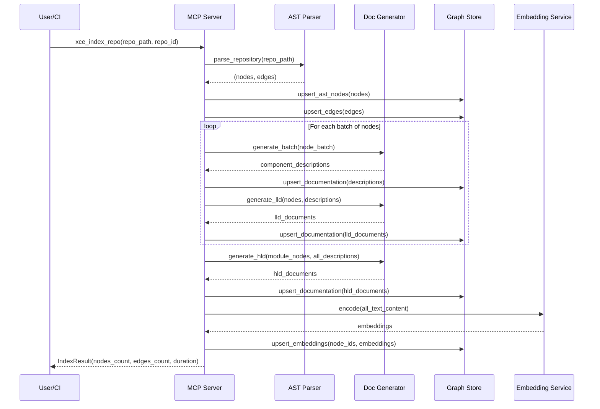

# Design Document: Xanther Context Engine (XCE)

## Overview

The Xanther Context Engine (XCE) is a Graph RAG context retrieval system that parses code repositories, builds a rich knowledge graph from AST analysis and auto-generated documentation (component descriptions, LLD, HLD), and exposes intelligent graph traversal capabilities through an MCP server interface. Coding agents like Claude Sonnet query XCE for architectural context, trace chains, and impact analysis to improve their code understanding and modification accuracy.

The system is built around a five-stage pipeline: (1) AST extraction and indexing from source repositories, (2) LLM-powered documentation generation at component, LLD, and HLD levels, (3) storage in a graph database with semantic embeddings for hybrid search, (4) LangGraph-based agent traversal for architecture understanding, traceability, impact analysis, and discovery, and (5) context summarization via an efficient model (Kimi/GLM) that distills multi-hop graph traversals into coherent context windows for the coding agent.

Prior experimentation achieved 64% on SWE-Lite Django subset (vs 56% Sonnet baseline), 5.5% cost reduction, and 0% error rate on impact analysis. The target is to beat Claude Opus 4.6's 62.7% SOTA on full SWE-bench (Lite + Verified). The Django SWE-bench subset serves as the continuous validation test route during development.

## Architecture

### System Overview



### Deployment Architecture



All compute is CPU-only. Embeddings, summarization, and doc generation are handled via external API calls (OpenRouter, Kimi/GLM, LLM provider). No local GPU or model hosting required. RunPod CPU pod (~$0.03/hr) with persistent volume for Neo4j data and repo storage. Designed for future upgrade to a hosted service.

## Components and Interfaces

### Component 1: AST Parser

**Purpose**: Parses source code files into language-specific AST representations, extracting structural nodes (modules, classes, functions, imports, variables) and their relationships.

**Interface**:
```python
from dataclasses import dataclass
from enum import Enum
from typing import Optional

class NodeKind(Enum):
    MODULE = "module"
    CLASS = "class"
    FUNCTION = "function"
    METHOD = "method"
    IMPORT = "import"
    VARIABLE = "variable"
    DECORATOR = "decorator"
    ARGUMENT = "argument"

@dataclass
class ASTNode:
    id: str                          # Unique node identifier (repo:filepath:kind:name)
    kind: NodeKind
    name: str
    filepath: str
    start_line: int
    end_line: int
    source_text: str
    docstring: Optional[str] = None
    signature: Optional[str] = None
    parent_id: Optional[str] = None

@dataclass
class ASTEdge:
    source_id: str
    target_id: str
    relation: str                    # "contains", "calls", "imports", "inherits", "decorates"

class ASTParser:
    def parse_file(self, filepath: str, source: str) -> tuple[list[ASTNode], list[ASTEdge]]:
        """Parse a single file into AST nodes and edges."""
        ...

    def parse_repository(self, repo_path: str) -> tuple[list[ASTNode], list[ASTEdge]]:
        """Parse all supported files in a repository."""
        ...

    def detect_language(self, filepath: str) -> str:
        """Detect programming language from file extension."""
        ...
```

**Responsibilities**:
- Parse Python files using `ast` module (primary), with tree-sitter for multi-language support
- Extract structural nodes with full source text and metadata
- Resolve intra-file relationships (containment, calls, inheritance)
- Resolve cross-file relationships (imports, external calls)

### Component 2: Documentation Generator

**Purpose**: Uses an LLM to generate component descriptions, LLD, and HLD documentation from AST nodes and their relationships.

**Interface**:
```python
@dataclass
class ComponentDescription:
    node_id: str
    summary: str                     # 1-2 sentence description
    responsibilities: list[str]
    dependencies: list[str]

@dataclass
class LLDDocument:
    component_id: str
    algorithm_description: str
    data_flow: str
    error_handling: str
    edge_cases: list[str]

@dataclass
class HLDDocument:
    module_path: str
    architectural_role: str          # e.g., "controller", "service", "model", "utility"
    design_patterns: list[str]
    integration_points: list[str]
    quality_attributes: list[str]

class DocGenerator:
    def __init__(self, llm_client, batch_size: int = 10):
        ...

    async def generate_component_desc(self, node: ASTNode, context_nodes: list[ASTNode]) -> ComponentDescription:
        """Generate a component-level description for an AST node."""
        ...

    async def generate_lld(self, node: ASTNode, desc: ComponentDescription, callees: list[ASTNode]) -> LLDDocument:
        """Generate low-level design documentation for a component."""
        ...

    async def generate_hld(self, module_nodes: list[ASTNode], descs: list[ComponentDescription]) -> HLDDocument:
        """Generate high-level design documentation for a module/package."""
        ...

    async def generate_batch(self, nodes: list[ASTNode]) -> list[ComponentDescription]:
        """Batch-generate descriptions for efficiency."""
        ...
```

**Responsibilities**:
- Generate concise, accurate component descriptions from source code
- Produce LLD documents capturing algorithm details, data flow, error handling
- Produce HLD documents capturing architectural roles, patterns, integration points
- Batch processing for cost efficiency
- Prompt engineering for consistent, structured output

### Component 3: Graph Storage

**Purpose**: Stores all extracted knowledge in Neo4j with semantic search capabilities via vector embeddings.

**Interface**:
```python
from typing import Any

@dataclass
class GraphQuery:
    cypher: str
    params: dict[str, Any]

@dataclass
class SearchResult:
    node_id: str
    score: float
    node_data: dict[str, Any]
    path: Optional[list[str]] = None  # For traversal results

class GraphStore:
    def __init__(self, neo4j_uri: str, neo4j_auth: tuple[str, str]):
        ...

    async def upsert_ast_nodes(self, nodes: list[ASTNode]) -> int:
        """Upsert AST nodes into the graph. Returns count of nodes written."""
        ...

    async def upsert_edges(self, edges: list[ASTEdge]) -> int:
        """Upsert edges between AST nodes. Returns count of edges written."""
        ...

    async def upsert_documentation(self, docs: list[ComponentDescription | LLDDocument | HLDDocument]) -> int:
        """Attach documentation nodes to their corresponding AST nodes."""
        ...

    async def upsert_embeddings(self, node_ids: list[str], embeddings: list[list[float]]) -> int:
        """Store vector embeddings for semantic search."""
        ...

    async def semantic_search(self, query_embedding: list[float], top_k: int = 10, node_kinds: Optional[list[NodeKind]] = None) -> list[SearchResult]:
        """Perform vector similarity search, optionally filtered by node kind."""
        ...

    async def execute_query(self, query: GraphQuery) -> list[dict[str, Any]]:
        """Execute a raw Cypher query."""
        ...

    async def get_neighbors(self, node_id: str, relation: Optional[str] = None, depth: int = 1) -> list[SearchResult]:
        """Get neighboring nodes up to a given depth."""
        ...
```

**Responsibilities**:
- Manage Neo4j connection pool and transactions
- Schema management (node labels, relationship types, indexes)
- Vector index management for semantic search (Neo4j vector index or external FAISS)
- Upsert semantics for incremental re-indexing
- Query optimization for common traversal patterns

### Component 4: LangGraph Traversal Agents

**Purpose**: Implements four specialized agents using LangGraph that traverse the knowledge graph to answer different types of context queries.

**Interface**:
```python
from langgraph.graph import StateGraph
from typing import TypedDict

class TraversalState(TypedDict):
    query: str
    repo_id: str
    visited_nodes: list[str]
    collected_context: list[dict[str, Any]]
    current_depth: int
    max_depth: int
    reasoning_trace: list[str]

class TraversalResult:
    contexts: list[dict[str, Any]]
    reasoning: list[str]
    confidence: float
    nodes_visited: int

class ArchitectureAgent:
    """Maps files/symbols to HLD components and explains architectural context."""
    def __init__(self, graph_store: GraphStore, llm_client):
        ...

    async def query(self, file_or_symbol: str, repo_id: str) -> TraversalResult:
        """Given a file or symbol, return its architectural context."""
        ...

class TraceabilityAgent:
    """Builds trace chains between code and design artifacts."""
    def __init__(self, graph_store: GraphStore, llm_client):
        ...

    async def trace(self, source: str, target_level: str, repo_id: str) -> TraversalResult:
        """Trace from source (code/design) to target level (code/LLD/HLD)."""
        ...

class ImpactAnalysisAgent:
    """Predicts blast radius for proposed changes."""
    def __init__(self, graph_store: GraphStore, llm_client):
        ...

    async def analyze(self, changed_files: list[str], repo_id: str) -> TraversalResult:
        """Predict impact of changes to given files."""
        ...

class SearchDiscoveryAgent:
    """Performs semantic search and symbol discovery across the graph."""
    def __init__(self, graph_store: GraphStore, llm_client):
        ...

    async def search(self, query: str, repo_id: str, search_type: str = "semantic") -> TraversalResult:
        """Search the knowledge graph by semantic meaning or symbol name."""
        ...
```

**Responsibilities**:
- Architecture Agent: Map files → modules → HLD components, explain design rationale
- Traceability Agent: Build bidirectional trace chains (code ↔ LLD ↔ HLD)
- Impact Analysis Agent: Walk dependency graph to predict blast radius, rank by coupling strength
- Search & Discovery Agent: Hybrid semantic + structural search, tag-based filtering

### Component 5: Embedding Service

**Purpose**: Generates vector embeddings for AST nodes via the OpenRouter embedding API for semantic search capabilities.

**Interface**:
```python
class EmbeddingService:
    def __init__(self, api_key: str, model: str = "openai/text-embedding-3-small", dimensions: int = 512):
        ...

    async def encode(self, text: str) -> list[float]:
        """Encode a single text string into an embedding vector via OpenRouter API."""
        ...

    async def encode_batch(self, texts: list[str], batch_size: int = 100) -> list[list[float]]:
        """Batch encode texts via OpenRouter API. Handles rate limiting and batching."""
        ...

    def validate_dimensions(self, embedding: list[float]) -> bool:
        """Validate that embedding dimensions match configured model."""
        ...
```

### Component 6: Context Summarizer

**Interface**:
```python
@dataclass
class SummarizationRequest:
    traversal_results: list[TraversalResult]
    query: str
    max_tokens: int = 4000
    focus: str = "general"           # "architecture", "traceability", "impact", "search"

@dataclass
class SummarizedContext:
    summary: str
    key_facts: list[str]
    relevant_code_snippets: list[dict[str, str]]  # {"filepath": ..., "snippet": ...}
    confidence: float
    token_count: int

class ContextSummarizer:
    def __init__(self, model_name: str = "kimi", max_context_tokens: int = 4000):
        ...

    async def summarize(self, request: SummarizationRequest) -> SummarizedContext:
        """Summarize traversal results into a coherent context window."""
        ...

    def _rank_contexts(self, contexts: list[dict[str, Any]], query: str) -> list[dict[str, Any]]:
        """Rank collected contexts by relevance to the query."""
        ...

    def _truncate_to_budget(self, ranked_contexts: list[dict[str, Any]], max_tokens: int) -> list[dict[str, Any]]:
        """Truncate context list to fit within token budget."""
        ...
```

**Responsibilities**:
- Rank and deduplicate contexts from multiple traversal agents
- Summarize using efficient model (Kimi/GLM) to minimize cost
- Respect token budgets for the downstream coding agent
- Preserve code snippets verbatim while summarizing prose

### Component 7: MCP Server

**Purpose**: Exposes the context engine as an MCP-compliant server that coding agents can query.

**Interface**:
```python
from mcp.server import Server
from mcp.types import Tool, TextContent

class XCEMCPServer:
    def __init__(self, graph_store: GraphStore, agents: dict, summarizer: ContextSummarizer):
        self.server = Server("xanther-context-engine")
        ...

    def get_tools(self) -> list[Tool]:
        """Return MCP tool definitions."""
        return [
            Tool(
                name="xce_architecture_context",
                description="Get architectural context for a file or symbol",
                inputSchema={
                    "type": "object",
                    "properties": {
                        "file_or_symbol": {"type": "string"},
                        "repo_id": {"type": "string"},
                    },
                    "required": ["file_or_symbol", "repo_id"],
                },
            ),
            Tool(
                name="xce_trace",
                description="Trace relationships between code and design artifacts",
                inputSchema={
                    "type": "object",
                    "properties": {
                        "source": {"type": "string"},
                        "target_level": {"type": "string", "enum": ["code", "lld", "hld"]},
                        "repo_id": {"type": "string"},
                    },
                    "required": ["source", "target_level", "repo_id"],
                },
            ),
            Tool(
                name="xce_impact_analysis",
                description="Predict blast radius for proposed code changes",
                inputSchema={
                    "type": "object",
                    "properties": {
                        "changed_files": {"type": "array", "items": {"type": "string"}},
                        "repo_id": {"type": "string"},
                    },
                    "required": ["changed_files", "repo_id"],
                },
            ),
            Tool(
                name="xce_search",
                description="Search the knowledge graph by semantic meaning or symbol",
                inputSchema={
                    "type": "object",
                    "properties": {
                        "query": {"type": "string"},
                        "repo_id": {"type": "string"},
                        "search_type": {"type": "string", "enum": ["semantic", "symbol", "tag"]},
                    },
                    "required": ["query", "repo_id"],
                },
            ),
            Tool(
                name="xce_index_repo",
                description="Index or re-index a code repository",
                inputSchema={
                    "type": "object",
                    "properties": {
                        "repo_path": {"type": "string"},
                        "repo_id": {"type": "string"},
                        "incremental": {"type": "boolean", "default": True},
                    },
                    "required": ["repo_path", "repo_id"],
                },
            ),
        ]

    async def handle_tool_call(self, name: str, arguments: dict) -> list[TextContent]:
        """Route MCP tool calls to the appropriate agent."""
        ...
```

**Responsibilities**:
- Implement MCP protocol (stdio or SSE transport)
- Route tool calls to appropriate agents
- Format responses as MCP TextContent
- Handle errors gracefully with informative messages
- Support both indexing and querying operations

### Component 8: SWE-bench Test Harness

**Purpose**: Validates XCE against the SWE-bench Django subset during development, providing continuous feedback on context quality.

**Interface**:
```python
@dataclass
class SWEBenchInstance:
    instance_id: str
    repo: str
    base_commit: str
    problem_statement: str
    patch: str                       # Gold patch for evaluation
    test_patch: str

@dataclass
class EvalResult:
    instance_id: str
    resolved: bool
    context_used: SummarizedContext
    agent_patch: str
    cost_usd: float
    latency_seconds: float

class SWEBenchTestHarness:
    def __init__(self, mcp_server: XCEMCPServer, coding_agent_client, dataset_path: str):
        ...

    async def run_instance(self, instance: SWEBenchInstance) -> EvalResult:
        """Run a single SWE-bench instance through the full pipeline."""
        ...

    async def run_django_subset(self) -> list[EvalResult]:
        """Run the Django subset as the primary validation route."""
        ...

    def compute_metrics(self, results: list[EvalResult]) -> dict[str, float]:
        """Compute aggregate metrics: resolve rate, cost, latency, error rate."""
        ...

    def compare_to_baseline(self, results: list[EvalResult], baseline: dict[str, float]) -> dict[str, Any]:
        """Compare results against baseline metrics."""
        ...
```

**Responsibilities**:
- Load and manage SWE-bench dataset instances
- Orchestrate end-to-end evaluation: index repo → query context → generate patch → evaluate
- Track metrics: resolve rate, cost per instance, latency, error rate
- Compare against baselines (56% Sonnet, 62.7% Opus SOTA)
- Integrate into CI/CD for continuous validation during development

### Component 9: Reasoning Chain Builder

**Purpose**: Takes flat traversal results from agents and pre-computes multi-hop reasoning chains that connect 3-4 insights together as structured narratives. Instead of dumping a flat list of nodes, the builder produces chains like "QuerySet.filter() → calls Q.__or__() → which uses _combine() → which serializes via Connector". This gives the coding agent a connected story rather than disconnected facts.

**Interface**:
```python
@dataclass
class ReasoningChain:
    chain_id: str
    steps: list[ChainStep]          # Ordered sequence of 3-4 connected insights
    narrative: str                   # Human-readable narrative connecting the steps
    confidence: float                # How well-supported the chain is by graph evidence
    entry_node_id: str               # Starting node of the chain

@dataclass
class ChainStep:
    node_id: str
    node_name: str
    relationship: str                # How this step connects to the next (e.g., "calls", "imports", "inherits")
    insight: str                     # One-sentence insight about this step's role
    source_snippet: Optional[str]    # Relevant code snippet

class ReasoningChainBuilder:
    def __init__(self, graph_store: GraphStore, llm_client, max_chain_length: int = 4):
        ...

    async def build_chains(
        self, traversal_results: list[TraversalResult], query: str, max_chains: int = 5
    ) -> list[ReasoningChain]:
        """
        Analyze traversal results and construct multi-hop reasoning chains.
        Each chain connects 3-4 related nodes into a narrative.
        """
        ...

    async def _find_connected_paths(
        self, contexts: list[dict], graph_store: GraphStore
    ) -> list[list[str]]:
        """Find paths of 3-4 connected nodes in the traversal results."""
        ...

    async def _narrate_chain(
        self, path: list[dict], query: str
    ) -> str:
        """Use LLM to generate a concise narrative for a chain of connected nodes."""
        ...
```

**Responsibilities**:
- Analyze traversal results to identify connected subgraphs of 3-4 nodes
- Use graph edges (CALLS, IMPORTS, INHERITS, CONTAINS) to find meaningful paths
- Generate human-readable narratives for each chain via LLM
- Rank chains by relevance to the original query
- Pass structured chains to the summarizer instead of flat node lists

### Component 10: Test Patch Analyzer

**Purpose**: Parses the SWE-bench `test_patch` to identify which production code the tests exercise. Extracts tested symbols, files, expected behaviors, and edge cases. Feeds this as high-priority signal to the traversal agents so context retrieval is guided by what the fix actually needs to touch. The `test_patch` is part of the SWE-bench instance data — all top entries use it.

**Interface**:
```python
@dataclass
class TestPatchSignal:
    tested_files: list[str]          # Production files the tests import/reference
    tested_symbols: list[str]        # Function/class names exercised by tests
    test_assertions: list[str]       # Key assertions (expected behaviors)
    edge_cases: list[str]            # Edge cases the tests cover
    priority_score: dict[str, float] # symbol -> priority (1.0 = directly tested, 0.5 = indirectly referenced)

class TestPatchAnalyzer:
    def __init__(self):
        ...

    def analyze(self, test_patch: str, repo_id: str) -> TestPatchSignal:
        """
        Parse a test patch diff and extract signals about what production
        code needs to be fixed.
        """
        ...

    def _extract_imports(self, test_patch: str) -> list[str]:
        """Extract import statements from the test patch to identify target modules."""
        ...

    def _extract_tested_symbols(self, test_patch: str) -> list[str]:
        """Extract function/class names that are called or instantiated in tests."""
        ...

    def _extract_assertions(self, test_patch: str) -> list[str]:
        """Extract assert statements to understand expected behavior."""
        ...

    def _extract_edge_cases(self, test_patch: str) -> list[str]:
        """Identify edge case patterns (boundary values, None checks, empty inputs)."""
        ...

    def boost_traversal_priority(
        self, signal: TestPatchSignal, traversal_state: TraversalState
    ) -> TraversalState:
        """Inject test patch signals as high-priority seeds into traversal state."""
        ...
```

**Responsibilities**:
- Parse unified diff format of test patches
- Extract import targets to identify which production files are relevant
- Extract function/class names being tested to identify fix targets
- Extract assertions to understand expected behavior
- Extract edge case patterns to inform context retrieval
- Boost priority of tested symbols in traversal agent state

### Component 11: Patch Pattern Index

**Purpose**: Indexes gold patches from previously solved SWE-bench instances. When a new problem arrives, finds structurally similar past patches (same files, same code patterns, same fix types) and includes them as few-shot examples in the context. This is few-shot prompting with real, proven examples.

**Interface**:
```python
@dataclass
class PatchPattern:
    instance_id: str                 # SWE-bench instance ID
    repo: str                        # Repository name
    changed_files: list[str]         # Files modified by the patch
    changed_symbols: list[str]       # Functions/classes modified
    patch_type: str                  # "bugfix", "feature", "refactor", "test"
    diff_text: str                   # The actual patch diff
    problem_statement: str           # Original problem description
    structural_signature: str        # Hash of (files, symbols, patch_type) for fast lookup
    embedding: Optional[list[float]] # Embedding of problem_statement for semantic search

@dataclass
class SimilarPatch:
    pattern: PatchPattern
    similarity_score: float          # Combined structural + semantic similarity
    relevance_explanation: str       # Why this patch is relevant

class PatchPatternIndex:
    def __init__(self, graph_store: GraphStore, embedding_service: EmbeddingService):
        ...

    async def index_gold_patches(self, instances: list[SWEBenchInstance]) -> int:
        """Index gold patches from solved SWE-bench instances. Returns count indexed."""
        ...

    async def find_similar(
        self, problem_statement: str, changed_files: list[str], top_k: int = 3
    ) -> list[SimilarPatch]:
        """
        Find structurally similar past patches. Uses both structural matching
        (same files/symbols) and semantic matching (similar problem description).
        """
        ...

    def _compute_structural_signature(self, changed_files: list[str], changed_symbols: list[str]) -> str:
        """Compute a structural hash for fast lookup of similar patches."""
        ...

    def _compute_similarity(
        self, candidate: PatchPattern, problem_embedding: list[float], target_files: list[str]
    ) -> float:
        """
        Combined similarity: 0.4 * structural_overlap + 0.6 * semantic_similarity.
        Structural overlap = Jaccard similarity of changed files/symbols.
        """
        ...
```

**Responsibilities**:
- Parse and index gold patches from solved SWE-bench instances
- Store patch patterns with structural signatures and semantic embeddings
- Retrieve similar patches using hybrid structural + semantic matching
- Provide few-shot examples to the coding agent for pattern-guided fixes
- Maintain a growing index as more instances are solved

### Component 12: Refinement Loop

**Purpose**: Orchestrates an iterative cycle: context → patch attempt → run tests → analyze failures → refine context → retry. Instead of one-shot context generation, the loop uses test failure feedback to improve context on subsequent passes. The Impact Analysis Agent predicts what broke and why, feeding better-targeted context on retries. Maximum 3 iterations.

**Interface**:
```python
@dataclass
class RefinementState:
    iteration: int                   # Current iteration (0-indexed)
    max_iterations: int              # Maximum iterations (default 3)
    problem_statement: str
    repo_id: str
    current_context: SummarizedContext
    patch_attempts: list[str]        # Patches generated so far
    test_results: list[TestResult]   # Test outcomes per iteration
    failure_analysis: list[str]      # What broke and why, per iteration
    converged: bool                  # True if tests pass or no progress

@dataclass
class TestResult:
    passed: bool
    failed_tests: list[str]          # Names of failing tests
    error_messages: list[str]        # Error output from failed tests
    coverage_delta: Optional[float]  # Change in test pass rate vs previous iteration

class RefinementLoop:
    def __init__(
        self,
        mcp_server: XCEMCPServer,
        impact_agent: ImpactAnalysisAgent,
        summarizer: ContextSummarizer,
        test_runner,
        max_iterations: int = 3,
    ):
        ...

    async def run(
        self, problem_statement: str, repo_id: str, initial_context: SummarizedContext, test_patch: str
    ) -> RefinementState:
        """
        Run the iterative refinement loop. Returns final state with best patch.
        """
        ...

    async def _generate_patch(self, context: SummarizedContext, problem: str, history: list[str]) -> str:
        """Generate a patch attempt using the coding agent with current context."""
        ...

    async def _run_tests(self, patch: str, test_patch: str, repo_id: str) -> TestResult:
        """Apply patch, run test_patch tests, return results."""
        ...

    async def _analyze_failure(
        self, test_result: TestResult, current_context: SummarizedContext, patch: str
    ) -> str:
        """Use Impact Analysis Agent to predict what broke and why."""
        ...

    async def _refine_context(
        self, failure_analysis: str, current_context: SummarizedContext, repo_id: str
    ) -> SummarizedContext:
        """Generate improved context based on failure analysis."""
        ...

    def _should_stop(self, state: RefinementState) -> bool:
        """Stop if tests pass, max iterations reached, or no progress between iterations."""
        ...
```

**Responsibilities**:
- Orchestrate the context → patch → test → refine cycle
- Track patch attempts and test results across iterations
- Use Impact Analysis Agent to diagnose test failures
- Refine context by adding missing information identified from failures
- Detect convergence (tests pass) or stagnation (no progress) to stop early
- Cap at 3 iterations to bound cost

### Component 13: Complexity Router

**Purpose**: Classifies problem complexity and routes to the appropriate model/pipeline depth. Simple one-file fixes skip the full traversal pipeline and use a fast, cheap model. Complex multi-file reasoning problems get the full pipeline with Kimi thinking for hard reasoning (impact analysis, multi-hop traces). This reduces cost and latency for easy problems while preserving quality for hard ones.

**Interface**:
```python
class ProblemComplexity(Enum):
    SIMPLE = "simple"                # Single file, obvious fix, no cross-file deps
    MODERATE = "moderate"            # 2-3 files, some cross-file deps
    COMPLEX = "complex"              # Multi-file, deep dependency chains, design-level changes

@dataclass
class RoutingDecision:
    complexity: ProblemComplexity
    pipeline_depth: str              # "shallow" (skip traversal), "standard", "deep" (full pipeline + reasoning)
    model_tier: str                  # "fast" (cheap model), "standard", "reasoning" (Kimi thinking)
    skip_agents: list[str]           # Agent names to skip for this complexity level
    estimated_cost_multiplier: float # 1.0 = baseline, 0.3 = cheap, 2.0 = expensive
    reasoning: str                   # Why this routing was chosen

class ComplexityRouter:
    def __init__(self, graph_store: GraphStore, llm_client):
        ...

    async def classify(
        self, problem_statement: str, test_patch_signal: Optional[TestPatchSignal] = None, repo_id: Optional[str] = None
    ) -> RoutingDecision:
        """
        Classify problem complexity and determine routing.
        Uses heuristics + lightweight LLM classification.
        """
        ...

    def _heuristic_classify(self, problem_statement: str, test_signal: Optional[TestPatchSignal]) -> ProblemComplexity:
        """
        Fast heuristic classification based on:
        - Number of files mentioned in problem/test patch
        - Presence of cross-file keywords ("import", "dependency", "inheritance")
        - Problem statement length and complexity indicators
        """
        ...

    def _build_routing(self, complexity: ProblemComplexity) -> RoutingDecision:
        """Map complexity to pipeline configuration."""
        ...
```

**Routing Rules**:
- `SIMPLE`: Use fast model (e.g., GPT-4o-mini), skip Architecture and Traceability agents, only run Search agent for file lookup. Cost multiplier ~0.3x.
- `MODERATE`: Use standard model, run Search + Impact agents, skip full Architecture traversal. Cost multiplier ~0.7x.
- `COMPLEX`: Use Kimi thinking model for Impact Analysis and Reasoning Chain Builder, run all agents at full depth. Cost multiplier ~1.5x.

**Responsibilities**:
- Classify problem complexity using heuristics and lightweight LLM
- Route to appropriate pipeline depth and model tier
- Skip unnecessary agents for simple problems
- Use expensive reasoning models only for complex problems
- Track routing decisions for cost analysis and tuning

### Component 14: Problem Decomposition Agent

**Purpose**: A LangGraph agent that breaks the problem statement into targeted sub-tasks before querying context. For example, "Fix QuerySet.filter() for nested Q objects" becomes: (1) find filter() implementation, (2) find Q object serialization, (3) find test cases for nested Q, (4) find similar past fixes. Each sub-task gets its own targeted traversal, producing more focused and relevant context.

**Interface**:
```python
@dataclass
class SubTask:
    task_id: str
    description: str                 # What to find/understand
    search_queries: list[str]        # Specific queries for the traversal agents
    target_agent: str                # Which agent to use ("architecture", "trace", "impact", "search")
    priority: int                    # Execution priority (1 = highest)
    depends_on: list[str]            # task_ids this sub-task depends on

@dataclass
class DecompositionResult:
    original_problem: str
    sub_tasks: list[SubTask]
    execution_plan: list[list[str]]  # Parallelizable groups of task_ids
    estimated_traversals: int        # Total number of agent queries needed

class ProblemDecompositionAgent:
    def __init__(self, llm_client, graph_store: GraphStore):
        ...

    async def decompose(
        self, problem_statement: str, test_patch_signal: Optional[TestPatchSignal] = None, repo_id: Optional[str] = None
    ) -> DecompositionResult:
        """
        Break a problem statement into targeted sub-tasks.
        Uses LLM to understand the problem and graph metadata to ground sub-tasks.
        """
        ...

    async def execute_plan(
        self, decomposition: DecompositionResult, agents: dict, repo_id: str
    ) -> list[TraversalResult]:
        """
        Execute the decomposition plan, running sub-tasks through appropriate agents.
        Respects dependencies and parallelizes independent sub-tasks.
        """
        ...

    def _build_state_graph(self) -> StateGraph:
        """
        Build the LangGraph state machine:
        analyze_problem → generate_subtasks → validate_subtasks → plan_execution → END
        """
        ...

    async def _validate_subtasks(self, sub_tasks: list[SubTask], graph_store: GraphStore) -> list[SubTask]:
        """
        Validate sub-tasks against the graph — check that referenced symbols/files exist.
        Remove or adjust sub-tasks that reference non-existent entities.
        """
        ...
```

**Responsibilities**:
- Parse problem statements to identify distinct information needs
- Generate targeted sub-tasks with specific search queries
- Assign each sub-task to the most appropriate traversal agent
- Build an execution plan that respects dependencies and enables parallelism
- Validate sub-tasks against the graph to ensure they reference real entities
- Execute the plan and aggregate results from all sub-task traversals

## Data Models

### Graph Schema



### Neo4j Schema Constraints

```python
SCHEMA_CONSTRAINTS = [
    "CREATE CONSTRAINT ast_node_id IF NOT EXISTS FOR (n:ASTNode) REQUIRE n.id IS UNIQUE",
    "CREATE CONSTRAINT repo_id IF NOT EXISTS FOR (r:Repository) REQUIRE r.repo_id IS UNIQUE",
    "CREATE INDEX ast_kind_idx IF NOT EXISTS FOR (n:ASTNode) ON (n.kind)",
    "CREATE INDEX ast_filepath_idx IF NOT EXISTS FOR (n:ASTNode) ON (n.filepath)",
    "CREATE INDEX ast_name_idx IF NOT EXISTS FOR (n:ASTNode) ON (n.name)",
    "CREATE VECTOR INDEX embedding_idx IF NOT EXISTS FOR (n:Embedding) ON (n.vector) OPTIONS {indexConfig: {`vector.dimensions`: 512, `vector.similarity_function`: 'cosine'}}",
]
```

### Validation Rules

- `ASTNode.id` must follow format `{repo_id}:{filepath}:{kind}:{name}`
- `ASTNode.start_line <= ASTNode.end_line`
- `ASTNode.kind` must be a valid `NodeKind` enum value
- `ComponentDescription.node_id` must reference an existing `ASTNode.id`
- `LLDDocument.component_id` must reference an existing `ComponentDescription.node_id`
- `HLDDocument.module_path` must correspond to an actual directory in the repository
- Embedding vectors must match the configured OpenRouter model dimensions (e.g., 512 for `text-embedding-3-small`)
- `Repository.repo_id` must be unique across the system

## Sequence Diagrams

### Indexing Flow



### Query Flow (Impact Analysis Example)

```mermaid
sequenceDiagram
    participant Agent as Coding Agent
    participant MCP as MCP Server
    participant Impact as Impact Agent
    participant Graph as Graph Store
    participant Summ as Summarizer

    Agent->>MCP: xce_impact_analysis(changed_files, repo_id)
    MCP->>Impact: analyze(changed_files, repo_id)
    
    loop For each changed file
        Impact->>Graph: get_neighbors(file_node_id, depth=1)
        Graph-->>Impact: direct_dependents
        
        Impact->>Graph: execute_query(reverse_call_graph)
        Graph-->>Impact: transitive_callers
        
        Impact->>Graph: get_neighbors(file_node_id, "PART_OF_HLD")
        Graph-->>Impact: hld_components
    end
    
    Impact->>Impact: rank_by_coupling_strength()
    Impact->>Impact: compute_blast_radius()
    Impact-->>MCP: TraversalResult(contexts, reasoning, confidence)
    
    MCP->>Summ: summarize(traversal_results, query)
    Summ-->>MCP: SummarizedContext
    
    MCP-->>Agent: TextContent(summary, key_facts, code_snippets)
```




## Algorithmic Pseudocode

### Algorithm 1: Repository Indexing Pipeline

```python
async def index_repository(repo_path: str, repo_id: str, incremental: bool = True) -> IndexResult:
    """
    Main indexing pipeline that orchestrates AST parsing, doc generation,
    and graph storage for an entire repository.
    """
    # Step 1: Discover files to process
    all_files = discover_source_files(repo_path, extensions=[".py"])
    
    if incremental:
        changed_files = filter_changed_since_last_index(all_files, repo_id)
    else:
        changed_files = all_files
    
    # Step 2: Parse AST for all changed files
    all_nodes: list[ASTNode] = []
    all_edges: list[ASTEdge] = []
    
    for filepath in changed_files:
        source = read_file(filepath)
        nodes, edges = parser.parse_file(filepath, source)
        all_nodes.extend(nodes)
        all_edges.extend(edges)
    
    # Step 3: Resolve cross-file references
    cross_file_edges = resolve_cross_file_imports(all_nodes, all_edges)
    all_edges.extend(cross_file_edges)
    
    # Step 4: Store AST in graph
    await graph_store.upsert_ast_nodes(all_nodes)
    await graph_store.upsert_edges(all_edges)
    
    # Step 5: Generate documentation in batches
    for batch in chunk(all_nodes, size=BATCH_SIZE):
        # Component descriptions
        descriptions = await doc_generator.generate_batch(batch)
        await graph_store.upsert_documentation(descriptions)
        
        # LLD for functions/methods
        func_nodes = [n for n in batch if n.kind in (NodeKind.FUNCTION, NodeKind.METHOD)]
        for node, desc in zip(func_nodes, filter_descs(descriptions, func_nodes)):
            callees = get_callees(node, all_edges, all_nodes)
            lld = await doc_generator.generate_lld(node, desc, callees)
            await graph_store.upsert_documentation([lld])
    
    # Step 6: Generate HLD per module
    modules = group_by_module(all_nodes)
    for module_path, module_nodes in modules.items():
        descs = await graph_store.get_descriptions_for_nodes(module_nodes)
        hld = await doc_generator.generate_hld(module_nodes, descs)
        await graph_store.upsert_documentation([hld])
    
    # Step 7: Generate and store embeddings
    texts = [build_embedding_text(n) for n in all_nodes]
    embeddings = await embedding_service.encode_batch(texts)
    await graph_store.upsert_embeddings(
        [n.id for n in all_nodes], embeddings
    )
    
    return IndexResult(
        nodes_count=len(all_nodes),
        edges_count=len(all_edges),
        repos_indexed=1,
    )
```

**Preconditions:**
- `repo_path` points to a valid, readable directory containing source files
- `repo_id` is a non-empty unique identifier
- Neo4j instance is reachable and schema is initialized
- LLM client and embedding service are available

**Postconditions:**
- All AST nodes from changed files are stored in the graph with unique IDs
- All edges (containment, calls, imports, inheritance) are stored
- Every AST node has an associated `ComponentDescription`
- Every function/method node has an associated `LLDDocument`
- Every module has an associated `HLDDocument`
- All nodes have vector embeddings stored and indexed
- If `incremental=True`, only changed files are reprocessed; existing data for unchanged files is preserved

**Loop Invariants:**
- After processing each batch: all nodes in completed batches have descriptions stored in the graph
- After processing each module: the module's HLD document is consistent with its current component descriptions
- The graph remains in a valid state after each upsert (no orphaned edges)

### Algorithm 2: Impact Analysis Graph Traversal

```python
async def analyze_impact(changed_files: list[str], repo_id: str, max_depth: int = 3) -> TraversalResult:
    """
    Traverse the knowledge graph to predict the blast radius of changes
    to the given files. Uses reverse dependency walking with coupling
    strength ranking.
    """
    state = TraversalState(
        query=f"impact of changes to {changed_files}",
        repo_id=repo_id,
        visited_nodes=[],
        collected_context=[],
        current_depth=0,
        max_depth=max_depth,
        reasoning_trace=[],
    )
    
    impact_set: dict[str, float] = {}  # node_id -> impact_score
    
    for filepath in changed_files:
        # Find all AST nodes in the changed file
        file_nodes = await graph_store.execute_query(GraphQuery(
            cypher="MATCH (n:ASTNode {filepath: $fp, repo_id: $rid}) RETURN n",
            params={"fp": filepath, "rid": repo_id},
        ))
        
        for node in file_nodes:
            node_id = node["n"]["id"]
            state.visited_nodes.append(node_id)
            
            # Walk reverse call graph
            reverse_callers = await walk_reverse_dependencies(
                graph_store, node_id, max_depth=max_depth, visited=set(state.visited_nodes)
            )
            
            for caller, depth in reverse_callers:
                # Score decays with distance: score = 1.0 / (depth + 1)
                score = 1.0 / (depth + 1)
                if caller.id in impact_set:
                    impact_set[caller.id] = max(impact_set[caller.id], score)
                else:
                    impact_set[caller.id] = score
                
                state.visited_nodes.append(caller.id)
            
            # Collect HLD context for impacted components
            hld_nodes = await graph_store.get_neighbors(node_id, "PART_OF_HLD")
            for hld in hld_nodes:
                state.collected_context.append({
                    "type": "hld_impact",
                    "node_id": hld.node_id,
                    "data": hld.node_data,
                    "impact_score": 1.0,  # Direct HLD impact
                })
    
    # Rank by impact score and collect context
    ranked_impacts = sorted(impact_set.items(), key=lambda x: x[1], reverse=True)
    
    for node_id, score in ranked_impacts[:50]:  # Top 50 impacted nodes
        node_data = await graph_store.execute_query(GraphQuery(
            cypher="MATCH (n:ASTNode {id: $nid})-[:DESCRIBED_BY]->(d) RETURN n, d",
            params={"nid": node_id},
        ))
        state.collected_context.append({
            "type": "impacted_node",
            "node_id": node_id,
            "data": node_data,
            "impact_score": score,
        })
    
    state.reasoning_trace.append(
        f"Analyzed {len(changed_files)} files, found {len(impact_set)} impacted nodes, "
        f"visited {len(state.visited_nodes)} nodes total"
    )
    
    return TraversalResult(
        contexts=state.collected_context,
        reasoning=state.reasoning_trace,
        confidence=compute_confidence(impact_set, state.visited_nodes),
        nodes_visited=len(state.visited_nodes),
    )


async def walk_reverse_dependencies(
    graph_store: GraphStore,
    start_node_id: str,
    max_depth: int,
    visited: set[str],
) -> list[tuple[ASTNode, int]]:
    """
    BFS walk of reverse dependency graph (who calls/imports this node).
    Returns list of (node, depth) tuples.
    """
    result = []
    queue = [(start_node_id, 0)]
    
    while queue:
        current_id, depth = queue.pop(0)
        
        if depth >= max_depth:
            continue
        
        # Find all nodes that CALL or IMPORT this node
        callers = await graph_store.execute_query(GraphQuery(
            cypher="""
                MATCH (caller:ASTNode)-[:CALLS|IMPORTS]->(target:ASTNode {id: $nid})
                RETURN caller
            """,
            params={"nid": current_id},
        ))
        
        for caller_record in callers:
            caller_id = caller_record["caller"]["id"]
            if caller_id not in visited:
                visited.add(caller_id)
                result.append((caller_record["caller"], depth + 1))
                queue.append((caller_id, depth + 1))
    
    return result
```

**Preconditions:**
- `changed_files` is a non-empty list of valid file paths within the indexed repository
- `repo_id` references a repository that has been fully indexed
- `max_depth >= 1`

**Postconditions:**
- Returns a `TraversalResult` containing all nodes within `max_depth` hops of any changed file's AST nodes via reverse CALLS/IMPORTS edges
- Each impacted node has an `impact_score` in range `(0, 1]` where `1.0` = direct dependency, decaying with distance
- `confidence` reflects coverage: higher when more of the graph was reachable
- No node appears more than once in the result; if reachable via multiple paths, the highest score is kept
- The `reasoning_trace` contains a human-readable summary of the analysis

**Loop Invariants:**
- BFS queue: all nodes in `visited` have been or will be processed; no node is enqueued twice
- Impact set: for every `node_id` in `impact_set`, `impact_set[node_id]` equals the maximum score across all paths from any changed file to that node
- Collected context: every entry has a valid `node_id` that exists in the graph

### Algorithm 3: Context Summarization

```python
async def summarize_contexts(
    traversal_results: list[TraversalResult],
    query: str,
    max_tokens: int = 4000,
) -> SummarizedContext:
    """
    Distill multiple traversal results into a coherent, token-efficient
    context window for the coding agent.
    """
    # Step 1: Merge and deduplicate contexts from all traversals
    all_contexts = []
    seen_node_ids = set()
    
    for result in traversal_results:
        for ctx in result.contexts:
            if ctx["node_id"] not in seen_node_ids:
                seen_node_ids.add(ctx["node_id"])
                all_contexts.append(ctx)
    
    # Step 2: Rank by relevance to query
    query_embedding = await embedding_service.encode(query)
    scored_contexts = []
    
    for ctx in all_contexts:
        ctx_text = extract_text(ctx)
        ctx_embedding = await embedding_service.encode(ctx_text)
        similarity = cosine_similarity(query_embedding, ctx_embedding)
        
        # Combine semantic similarity with impact score if available
        impact_score = ctx.get("impact_score", 0.5)
        combined_score = 0.6 * similarity + 0.4 * impact_score
        scored_contexts.append((ctx, combined_score))
    
    scored_contexts.sort(key=lambda x: x[1], reverse=True)
    
    # Step 3: Select contexts within token budget
    selected_contexts = []
    token_count = 0
    RESERVED_FOR_SUMMARY = 800  # Reserve tokens for the summary itself
    
    for ctx, score in scored_contexts:
        ctx_tokens = count_tokens(extract_text(ctx))
        if token_count + ctx_tokens <= max_tokens - RESERVED_FOR_SUMMARY:
            selected_contexts.append(ctx)
            token_count += ctx_tokens
        else:
            break
    
    # Step 4: Generate summary using efficient model
    summary_prompt = build_summary_prompt(query, selected_contexts)
    summary_response = await summarizer_llm.generate(summary_prompt)
    
    # Step 5: Extract code snippets (preserved verbatim)
    code_snippets = []
    for ctx in selected_contexts:
        if "source_text" in ctx.get("data", {}):
            code_snippets.append({
                "filepath": ctx["data"].get("filepath", "unknown"),
                "snippet": ctx["data"]["source_text"],
            })
    
    return SummarizedContext(
        summary=summary_response,
        key_facts=extract_key_facts(summary_response),
        relevant_code_snippets=code_snippets,
        confidence=compute_aggregate_confidence(traversal_results),
        token_count=count_tokens(summary_response) + token_count,
    )
```

**Preconditions:**
- `traversal_results` is non-empty; each result contains at least one context entry
- `query` is a non-empty string describing what the coding agent needs
- `max_tokens > RESERVED_FOR_SUMMARY` (i.e., `max_tokens > 800`)
- Embedding service and summarizer LLM are available

**Postconditions:**
- `SummarizedContext.token_count <= max_tokens`
- `SummarizedContext.summary` is a coherent natural language summary of the selected contexts
- `SummarizedContext.relevant_code_snippets` contains verbatim source code (not paraphrased)
- No duplicate `node_id` appears in the selected contexts
- Contexts are ordered by combined relevance score (semantic similarity + impact score)

**Loop Invariants:**
- Token budget: `token_count <= max_tokens - RESERVED_FOR_SUMMARY` at all times during selection
- Deduplication: `seen_node_ids` contains exactly the `node_id` values of all contexts added to `all_contexts`
- Ranking: `scored_contexts` is sorted in descending order of combined score after the sort step

### Algorithm 4: LangGraph Agent State Machine (Architecture Agent)

```python
from langgraph.graph import StateGraph, END

def build_architecture_agent_graph(graph_store: GraphStore, llm_client) -> StateGraph:
    """
    Constructs the LangGraph state machine for the Architecture Agent.
    States: locate -> expand -> enrich -> synthesize -> END
    """
    
    async def locate_node(state: TraversalState) -> TraversalState:
        """Find the target AST node(s) matching the query."""
        # Try exact match first
        results = await graph_store.execute_query(GraphQuery(
            cypher="""
                MATCH (n:ASTNode)
                WHERE n.filepath CONTAINS $query OR n.name = $query
                AND n.repo_id = $rid
                RETURN n LIMIT 10
            """,
            params={"query": state["query"], "rid": state["repo_id"]},
        ))
        
        if not results:
            # Fall back to semantic search
            query_emb = await embedding_service.encode(state["query"])
            results = await graph_store.semantic_search(query_emb, top_k=5)
        
        state["visited_nodes"] = [r["n"]["id"] if "n" in r else r.node_id for r in results]
        state["reasoning_trace"].append(f"Located {len(results)} matching nodes")
        return state
    
    async def expand_context(state: TraversalState) -> TraversalState:
        """Expand to parent modules and HLD components."""
        for node_id in state["visited_nodes"][:5]:  # Limit expansion
            # Get containing module
            module = await graph_store.get_neighbors(node_id, "CONTAINS", depth=1)
            
            # Get HLD component
            hld = await graph_store.get_neighbors(node_id, "PART_OF_HLD", depth=1)
            
            # Get sibling nodes in same module
            siblings = await graph_store.execute_query(GraphQuery(
                cypher="""
                    MATCH (n:ASTNode {id: $nid})<-[:CONTAINS]-(parent)-[:CONTAINS]->(sibling)
                    RETURN sibling LIMIT 20
                """,
                params={"nid": node_id},
            ))
            
            for item in module + hld:
                state["collected_context"].append({
                    "type": "architectural_context",
                    "node_id": item.node_id,
                    "data": item.node_data,
                })
        
        state["current_depth"] += 1
        state["reasoning_trace"].append(f"Expanded to {len(state['collected_context'])} context items")
        return state
    
    async def enrich_with_docs(state: TraversalState) -> TraversalState:
        """Attach component descriptions and LLD docs to collected context."""
        enriched = []
        for ctx in state["collected_context"]:
            docs = await graph_store.execute_query(GraphQuery(
                cypher="""
                    MATCH (n:ASTNode {id: $nid})-[:DESCRIBED_BY]->(desc)
                    OPTIONAL MATCH (desc)-[:DETAILED_IN]->(lld)
                    RETURN desc, lld
                """,
                params={"nid": ctx["node_id"]},
            ))
            ctx["documentation"] = docs
            enriched.append(ctx)
        
        state["collected_context"] = enriched
        state["reasoning_trace"].append(f"Enriched {len(enriched)} contexts with documentation")
        return state
    
    async def should_continue(state: TraversalState) -> str:
        """Decide whether to continue expanding or synthesize."""
        if state["current_depth"] >= state["max_depth"]:
            return "synthesize"
        if len(state["collected_context"]) >= 30:
            return "synthesize"
        return "expand"
    
    # Build the graph
    workflow = StateGraph(TraversalState)
    workflow.add_node("locate", locate_node)
    workflow.add_node("expand", expand_context)
    workflow.add_node("enrich", enrich_with_docs)
    workflow.add_node("synthesize", lambda s: s)  # Terminal - return state
    
    workflow.set_entry_point("locate")
    workflow.add_edge("locate", "expand")
    workflow.add_conditional_edges("expand", should_continue, {
        "expand": "expand",
        "synthesize": "enrich",
    })
    workflow.add_edge("enrich", "synthesize")
    workflow.add_edge("synthesize", END)
    
    return workflow.compile()
```

**Preconditions:**
- `graph_store` is connected and the repository has been indexed
- `state["query"]` is a non-empty file path or symbol name
- `state["max_depth"] >= 1`

**Postconditions:**
- State machine terminates in finite steps (bounded by `max_depth` and context count limit of 30)
- `collected_context` contains architectural context: parent modules, HLD components, sibling nodes
- All collected contexts are enriched with `ComponentDescription` and `LLDDocument` where available
- `reasoning_trace` contains a step-by-step log of the traversal decisions

**Loop Invariants:**
- `current_depth` increases by 1 on each "expand" iteration and never exceeds `max_depth`
- `visited_nodes` only grows; no node is removed once visited
- `collected_context` only grows; enrichment modifies in place but does not remove entries

### Algorithm 5: Multi-hop Reasoning Chain Construction

```python
async def build_reasoning_chains(
    traversal_results: list[TraversalResult],
    query: str,
    graph_store: GraphStore,
    llm_client,
    max_chains: int = 5,
    max_chain_length: int = 4,
) -> list[ReasoningChain]:
    """
    Analyze traversal results and construct multi-hop reasoning chains.
    Each chain connects 3-4 related nodes into a narrative that explains
    how code elements relate to each other and to the problem.
    """
    # Step 1: Collect all unique node IDs from traversal results
    all_node_ids = set()
    node_data_map: dict[str, dict] = {}
    for result in traversal_results:
        for ctx in result.contexts:
            nid = ctx["node_id"]
            all_node_ids.add(nid)
            node_data_map[nid] = ctx

    # Step 2: Find connected paths of length 3-4 in the graph
    candidate_paths: list[list[str]] = []
    for node_id in all_node_ids:
        paths = await graph_store.execute_query(GraphQuery(
            cypher="""
                MATCH path = (start:ASTNode {id: $nid})-[:CALLS|IMPORTS|INHERITS|CONTAINS*2..3]->(end:ASTNode)
                WHERE end.id IN $node_ids
                RETURN [n IN nodes(path) | n.id] AS node_chain,
                       [r IN relationships(path) | type(r)] AS rel_chain
                LIMIT 20
            """,
            params={"nid": node_id, "node_ids": list(all_node_ids)},
        ))
        for record in paths:
            if len(record["node_chain"]) >= 3:
                candidate_paths.append(record)

    # Step 3: Score and rank candidate paths by relevance to query
    query_embedding = await embedding_service.encode(query)
    scored_paths = []
    for path_record in candidate_paths:
        chain_text = " → ".join(
            node_data_map.get(nid, {}).get("data", {}).get("name", nid)
            for nid in path_record["node_chain"]
        )
        chain_embedding = await embedding_service.encode(chain_text)
        score = cosine_similarity(query_embedding, chain_embedding)
        scored_paths.append((path_record, score))

    scored_paths.sort(key=lambda x: x[1], reverse=True)

    # Step 4: Build narrative for top chains
    chains: list[ReasoningChain] = []
    for path_record, score in scored_paths[:max_chains]:
        steps = []
        for i, nid in enumerate(path_record["node_chain"]):
            rel = path_record["rel_chain"][i] if i < len(path_record["rel_chain"]) else ""
            node_info = node_data_map.get(nid, {})
            steps.append(ChainStep(
                node_id=nid,
                node_name=node_info.get("data", {}).get("name", nid),
                relationship=rel,
                insight="",  # Filled by LLM below
                source_snippet=node_info.get("data", {}).get("source_text"),
            ))

        # Generate narrative via LLM
        narrative = await llm_client.generate(
            f"Given the query '{query}', explain how these code elements connect: "
            + " → ".join(f"{s.node_name} ({s.relationship})" for s in steps)
        )

        # Fill in per-step insights
        for step in steps:
            step.insight = await llm_client.generate(
                f"In one sentence, what role does {step.node_name} play in: {narrative}"
            )

        chains.append(ReasoningChain(
            chain_id=f"chain-{len(chains)}",
            steps=steps,
            narrative=narrative,
            confidence=score,
            entry_node_id=steps[0].node_id,
        ))

    return chains
```

**Preconditions:**
- `traversal_results` is non-empty with at least 3 unique node IDs across all results
- All node IDs in traversal results exist in the graph
- `max_chain_length >= 3` and `max_chains >= 1`

**Postconditions:**
- Returns at most `max_chains` reasoning chains
- Each chain has between 3 and `max_chain_length` steps
- Each step's `node_id` exists in the graph and was part of the traversal results
- Chains are ordered by descending relevance score to the query
- Each chain has a non-empty `narrative` explaining the connection

**Loop Invariants:**
- `all_node_ids` contains exactly the unique node IDs from all traversal results
- `candidate_paths` only contains paths where all nodes are in `all_node_ids`
- `scored_paths` is sorted by descending score after the sort step

### Algorithm 6: Test Patch Analysis

```python
def analyze_test_patch(test_patch: str, repo_id: str) -> TestPatchSignal:
    """
    Parse a SWE-bench test_patch diff to extract signals about which
    production code needs to be fixed. Uses AST parsing on the test
    code to identify imports, tested symbols, assertions, and edge cases.
    """
    # Step 1: Parse the diff to extract added/modified test code
    diff_hunks = parse_unified_diff(test_patch)
    added_lines = []
    test_files = []
    for hunk in diff_hunks:
        test_files.append(hunk.filepath)
        added_lines.extend(hunk.added_lines)

    test_source = "\n".join(added_lines)

    # Step 2: Extract imports → these point to production files
    import_pattern = re.compile(r"from\s+([\w.]+)\s+import\s+([\w, ]+)")
    tested_files = []
    tested_symbols = []
    for match in import_pattern.finditer(test_source):
        module_path = match.group(1).replace(".", "/") + ".py"
        tested_files.append(module_path)
        symbols = [s.strip() for s in match.group(2).split(",")]
        tested_symbols.extend(symbols)

    # Step 3: Extract function/method calls in test bodies
    call_pattern = re.compile(r"(?:self\.)?(\w+)\s*\(")
    for match in call_pattern.finditer(test_source):
        symbol = match.group(1)
        if symbol not in ("assert", "assertEqual", "assertTrue", "assertFalse",
                          "assertRaises", "assertIn", "setUp", "tearDown"):
            tested_symbols.append(symbol)

    tested_symbols = list(set(tested_symbols))

    # Step 4: Extract assertions → expected behaviors
    assert_pattern = re.compile(r"(self\.assert\w+\([^)]+\))")
    assertions = [m.group(1) for m in assert_pattern.finditer(test_source)]

    # Step 5: Identify edge cases
    edge_cases = []
    edge_patterns = {
        "None/null check": r"(?:None|null|nil)",
        "Empty collection": r"(?:\[\]|\(\)|{}|empty)",
        "Boundary value": r"(?:0|1|-1|MAX|MIN|boundary)",
        "Exception handling": r"(?:assertRaises|with self\.assertRaises)",
    }
    for case_name, pattern in edge_patterns.items():
        if re.search(pattern, test_source):
            edge_cases.append(case_name)

    # Step 6: Compute priority scores
    priority_score = {}
    for symbol in tested_symbols:
        # Directly imported symbols get highest priority
        if symbol in [s for m in import_pattern.finditer(test_source)
                      for s in m.group(2).split(",")]:
            priority_score[symbol] = 1.0
        else:
            priority_score[symbol] = 0.5

    return TestPatchSignal(
        tested_files=list(set(tested_files)),
        tested_symbols=tested_symbols,
        test_assertions=assertions,
        edge_cases=edge_cases,
        priority_score=priority_score,
    )
```

**Preconditions:**
- `test_patch` is a valid unified diff string (non-empty)
- `repo_id` is a valid repository identifier

**Postconditions:**
- `tested_files` contains paths to production files referenced by test imports
- `tested_symbols` contains deduplicated function/class names exercised by tests
- `priority_score` values are in range `[0.5, 1.0]` where 1.0 = directly imported
- `test_assertions` contains raw assertion strings from the test code
- `edge_cases` contains human-readable descriptions of detected edge case patterns

### Algorithm 7: Iterative Refinement Loop

```python
async def run_refinement_loop(
    problem_statement: str,
    repo_id: str,
    initial_context: SummarizedContext,
    test_patch: str,
    mcp_server: XCEMCPServer,
    impact_agent: ImpactAnalysisAgent,
    summarizer: ContextSummarizer,
    test_runner,
    max_iterations: int = 3,
) -> RefinementState:
    """
    Iterative refinement: context → patch → test → analyze → refine → retry.
    Stops when tests pass, max iterations reached, or no progress detected.
    """
    state = RefinementState(
        iteration=0,
        max_iterations=max_iterations,
        problem_statement=problem_statement,
        repo_id=repo_id,
        current_context=initial_context,
        patch_attempts=[],
        test_results=[],
        failure_analysis=[],
        converged=False,
    )

    prev_pass_rate = 0.0

    while state.iteration < state.max_iterations and not state.converged:
        # Step 1: Generate patch from current context
        patch = await generate_patch(
            context=state.current_context,
            problem=problem_statement,
            history=state.patch_attempts,  # Include prior attempts for the agent to learn from
        )
        state.patch_attempts.append(patch)

        # Step 2: Apply patch and run tests
        test_result = await test_runner.run(patch, test_patch, repo_id)
        state.test_results.append(test_result)

        # Step 3: Check for convergence
        if test_result.passed:
            state.converged = True
            break

        # Step 4: Check for progress (pass rate should improve)
        current_pass_rate = 1.0 - (len(test_result.failed_tests) / max(len(test_result.failed_tests) + 1, 1))
        if state.iteration > 0 and current_pass_rate <= prev_pass_rate:
            # No progress — stop to avoid wasting cost
            state.converged = True  # Stagnated
            break
        prev_pass_rate = current_pass_rate

        # Step 5: Analyze what went wrong
        failure_analysis = await impact_agent.analyze_failure(
            test_result=test_result,
            current_context=state.current_context,
            patch=patch,
        )
        state.failure_analysis.append(failure_analysis)

        # Step 6: Refine context based on failure analysis
        # Query for additional context targeting the failure points
        missing_context_query = f"Find code related to: {failure_analysis}"
        additional_results = await mcp_server.handle_tool_call(
            "xce_search",
            {"query": missing_context_query, "repo_id": repo_id, "search_type": "semantic"},
        )

        # Merge new context with existing
        state.current_context = await summarizer.summarize(SummarizationRequest(
            traversal_results=[state.current_context, additional_results],
            query=f"{problem_statement}\nFailure analysis: {failure_analysis}",
            max_tokens=state.current_context.token_count + 1000,  # Expand budget slightly
        ))

        state.iteration += 1

    return state
```

**Preconditions:**
- `initial_context` is a valid `SummarizedContext` from the first pass
- `test_patch` is a valid unified diff that can be applied to the repo
- `max_iterations >= 1`
- Test runner can apply patches and execute tests

**Postconditions:**
- `state.iteration <= max_iterations`
- `state.converged == True` if tests pass or no progress detected
- `len(state.patch_attempts) == len(state.test_results)` (one patch per iteration)
- If `state.test_results[-1].passed`, the last patch is the solution
- `state.failure_analysis` has one entry per failed iteration

**Loop Invariants:**
- `state.iteration` increases by 1 each loop and never exceeds `max_iterations`
- `len(state.patch_attempts) == state.iteration + 1` at end of each iteration (before increment)
- `prev_pass_rate` tracks the pass rate of the previous iteration for progress detection

### Algorithm 8: Problem Decomposition

```python
async def decompose_problem(
    problem_statement: str,
    test_patch_signal: Optional[TestPatchSignal],
    graph_store: GraphStore,
    llm_client,
    repo_id: str,
) -> DecompositionResult:
    """
    Break a problem statement into targeted sub-tasks. Each sub-task
    gets its own traversal query, producing more focused context.
    """
    # Step 1: Use LLM to identify distinct information needs
    decomposition_prompt = f"""
    Given this bug report, identify 3-5 distinct things we need to find in the codebase:
    
    Problem: {problem_statement}
    
    {"Tested symbols: " + ", ".join(test_patch_signal.tested_symbols) if test_patch_signal else ""}
    
    For each item, specify:
    1. What to find (description)
    2. Search query (specific symbol or concept)
    3. Which agent to use: architecture (understand structure), trace (follow dependencies),
       impact (find affected code), search (find specific code)
    """
    
    raw_subtasks = await llm_client.generate(decomposition_prompt)
    parsed_subtasks = parse_subtask_response(raw_subtasks)
    
    # Step 2: Validate sub-tasks against the graph
    validated_subtasks: list[SubTask] = []
    for i, st in enumerate(parsed_subtasks):
        # Check if referenced symbols exist in the graph
        exists = await graph_store.execute_query(GraphQuery(
            cypher="""
                MATCH (n:ASTNode)
                WHERE n.name CONTAINS $query AND n.repo_id = $rid
                RETURN count(n) as cnt
            """,
            params={"query": st["search_query"], "rid": repo_id},
        ))
        
        if exists[0]["cnt"] > 0 or st["agent"] == "search":
            validated_subtasks.append(SubTask(
                task_id=f"subtask-{i}",
                description=st["description"],
                search_queries=[st["search_query"]],
                target_agent=st["agent"],
                priority=i + 1,
                depends_on=st.get("depends_on", []),
            ))
    
    # Step 3: Inject test patch signals as additional sub-tasks
    if test_patch_signal:
        for symbol in test_patch_signal.tested_symbols[:3]:  # Top 3 tested symbols
            if symbol not in [sq for st in validated_subtasks for sq in st.search_queries]:
                validated_subtasks.append(SubTask(
                    task_id=f"subtask-test-{symbol}",
                    description=f"Find implementation of tested symbol: {symbol}",
                    search_queries=[symbol],
                    target_agent="search",
                    priority=0,  # Highest priority — directly from test patch
                    depends_on=[],
                ))
    
    # Step 4: Build execution plan (group independent tasks for parallel execution)
    execution_plan = build_execution_plan(validated_subtasks)
    
    return DecompositionResult(
        original_problem=problem_statement,
        sub_tasks=validated_subtasks,
        execution_plan=execution_plan,
        estimated_traversals=len(validated_subtasks),
    )


def build_execution_plan(sub_tasks: list[SubTask]) -> list[list[str]]:
    """
    Topological sort of sub-tasks respecting dependencies.
    Independent tasks are grouped for parallel execution.
    """
    # Build dependency graph
    dep_graph = {st.task_id: set(st.depends_on) for st in sub_tasks}
    plan = []
    remaining = set(dep_graph.keys())
    
    while remaining:
        # Find tasks with no unresolved dependencies
        ready = {tid for tid in remaining if dep_graph[tid].issubset(set().union(*plan) if plan else set())}
        if not ready:
            # Circular dependency — break by taking highest priority
            ready = {min(remaining, key=lambda tid: next(st.priority for st in sub_tasks if st.task_id == tid))}
        plan.append(sorted(ready))
        remaining -= ready
    
    return plan
```

**Preconditions:**
- `problem_statement` is a non-empty string describing the bug/feature
- `graph_store` is connected and the repository is indexed
- `repo_id` references an indexed repository

**Postconditions:**
- Returns 3-5 sub-tasks (may be fewer if validation removes invalid ones)
- Each sub-task has a valid `target_agent` in {"architecture", "trace", "impact", "search"}
- `execution_plan` is a valid topological ordering of sub-task IDs
- If `test_patch_signal` is provided, tested symbols appear as high-priority sub-tasks
- No sub-task references a symbol that doesn't exist in the graph (except "search" agent tasks)

**Loop Invariants:**
- `remaining` shrinks by at least 1 element per iteration of the execution plan builder
- Each task appears in exactly one group in the execution plan

## Key Functions with Formal Specifications

### Function: `resolve_cross_file_imports`

```python
def resolve_cross_file_imports(
    nodes: list[ASTNode], edges: list[ASTEdge]
) -> list[ASTEdge]:
    """
    Resolve import statements to their target AST nodes across files.
    Produces IMPORTS edges linking the importing node to the imported definition.
    """
    ...
```

**Preconditions:**
- `nodes` contains all AST nodes from all parsed files in the repository
- `edges` contains all intra-file edges (CONTAINS, CALLS within same file)
- Every `ASTNode` with `kind == IMPORT` has a `name` field containing the import target

**Postconditions:**
- Returns a list of `ASTEdge` objects with `relation == "imports"`
- For every IMPORT node `i` in `nodes`: if a node `t` exists in `nodes` where `t.name` matches the import target, then an edge `(i.id, t.id, "imports")` is in the result
- No duplicate edges in the result
- No self-referential edges (source_id != target_id)

### Function: `compute_confidence`

```python
def compute_confidence(
    impact_set: dict[str, float], visited_nodes: list[str]
) -> float:
    """
    Compute a confidence score for the impact analysis based on
    graph coverage and score distribution.
    """
    ...
```

**Preconditions:**
- `impact_set` is non-empty
- All values in `impact_set` are in range `(0, 1]`
- `visited_nodes` is non-empty

**Postconditions:**
- Returns a float in range `[0, 1]`
- Higher confidence when: more nodes visited, more uniform score distribution, fewer dead-end paths
- `confidence >= 0.8` when all direct dependencies were reachable and scored

### Function: `build_embedding_text`

```python
def build_embedding_text(node: ASTNode) -> str:
    """
    Construct the text representation of an AST node for embedding.
    Combines name, signature, docstring, and a truncated source excerpt.
    """
    ...
```

**Preconditions:**
- `node` is a valid `ASTNode` with at least `name` and `kind` populated

**Postconditions:**
- Returns a non-empty string
- String length <= 512 tokens (truncated if necessary)
- Contains node name and kind as minimum content
- If `node.docstring` exists, it is included
- If `node.signature` exists, it is included
- Source text is truncated to first 200 characters if present

## Example Usage

```python
import asyncio
from xce.parser import ASTParser
from xce.doc_generator import DocGenerator
from xce.graph_store import GraphStore
from xce.agents import ArchitectureAgent, ImpactAnalysisAgent
from xce.summarizer import ContextSummarizer
from xce.mcp_server import XCEMCPServer

async def main():
    # Initialize components
    graph_store = GraphStore(
        neo4j_uri="bolt://localhost:7687",
        neo4j_auth=("neo4j", "password"),
    )
    parser = ASTParser()
    doc_gen = DocGenerator(llm_client=create_llm_client("gpt-4o-mini"))
    summarizer = ContextSummarizer(model_name="kimi")
    
    # Index a repository
    nodes, edges = parser.parse_repository("/path/to/django")
    await graph_store.upsert_ast_nodes(nodes)
    await graph_store.upsert_edges(edges)
    
    # Generate documentation
    for batch in chunk(nodes, size=10):
        descs = await doc_gen.generate_batch(batch)
        await graph_store.upsert_documentation(descs)
    
    # Query: What is the architectural context of django/views/generic/base.py?
    arch_agent = ArchitectureAgent(graph_store, llm_client)
    result = await arch_agent.query("django/views/generic/base.py", repo_id="django-main")
    
    # Query: What is the blast radius of changing django/db/models/query.py?
    impact_agent = ImpactAnalysisAgent(graph_store, llm_client)
    impact = await impact_agent.analyze(
        changed_files=["django/db/models/query.py"],
        repo_id="django-main",
    )
    
    # Summarize for coding agent
    context = await summarizer.summarize(SummarizationRequest(
        traversal_results=[result, impact],
        query="Fix QuerySet.filter() to handle nested Q objects correctly",
        max_tokens=4000,
    ))
    
    print(f"Summary: {context.summary}")
    print(f"Code snippets: {len(context.relevant_code_snippets)}")
    print(f"Token count: {context.token_count}")

    # Run via MCP server
    mcp_server = XCEMCPServer(graph_store, agents={...}, summarizer=summarizer)
    response = await mcp_server.handle_tool_call(
        "xce_impact_analysis",
        {"changed_files": ["django/db/models/query.py"], "repo_id": "django-main"},
    )

asyncio.run(main())
```


## Correctness Properties

The following properties must hold for the system to be correct. These are expressed as universal quantification statements suitable for property-based testing.

### P1: AST Parsing Completeness
**∀ file f in repository R: parse_file(f) produces nodes N and edges E such that every top-level definition (class, function, variable) in f has exactly one corresponding ASTNode in N.**

Testable via: Parse a known Python file, verify all definitions are captured.

### P2: AST Node ID Uniqueness
**∀ nodes n1, n2 produced by parse_repository(R): n1.id ≠ n2.id ⟹ (n1.filepath, n1.kind, n1.name) ≠ (n2.filepath, n2.kind, n2.name)**

Every AST node has a unique ID derived from its location and identity.

### P3: Edge Referential Integrity
**∀ edge e in edges E produced by parsing: ∃ node n1 in N where n1.id = e.source_id ∧ ∃ node n2 in N where n2.id = e.target_id**

No edge references a non-existent node.

### P4: Documentation Coverage
**∀ ASTNode n indexed in graph G: ∃ ComponentDescription d where d.node_id = n.id**

Every indexed node has a component description.

### P5: Impact Analysis Monotonicity
**∀ file sets S1 ⊆ S2: impact_set(S1) ⊆ impact_set(S2)**

Adding more changed files to the analysis can only increase (never decrease) the blast radius.

### P6: Impact Score Decay
**∀ node n at depth d from a changed file: impact_score(n) = 1/(d+1) ≤ 1.0**

Impact scores are bounded and decay with graph distance.

### P7: Summarization Token Budget
**∀ SummarizedContext c produced by summarize(): c.token_count ≤ request.max_tokens**

The summarizer never exceeds the requested token budget.

### P8: Deduplication Invariant
**∀ SummarizedContext c: |{ctx.node_id for ctx in c.selected_contexts}| = len(c.selected_contexts)**

No duplicate node IDs in the summarized context.

### P9: Semantic Search Relevance
**∀ query q, results R = semantic_search(embed(q), top_k=k): len(R) ≤ k ∧ ∀ i < j: R[i].score ≥ R[j].score**

Search results are bounded by top_k and sorted by descending score.

### P10: Graph Traversal Termination
**∀ traversal with max_depth=d: the traversal visits at most O(branching_factor^d) nodes and terminates in finite time.**

All graph traversals are bounded and terminate.

### P11: Idempotent Indexing
**∀ repository R: index(R); index(R) produces the same graph state as index(R)**

Re-indexing an unchanged repository produces identical results.

### P12: MCP Response Validity
**∀ MCP tool call t with valid arguments: handle_tool_call(t) returns a non-empty list of TextContent objects ∨ raises a well-formed error.**

Every valid MCP call produces a valid response.

### P13: Reasoning Chain Connectivity
**∀ ReasoningChain c produced by build_chains(): ∀ consecutive steps (s_i, s_{i+1}) in c.steps: ∃ edge e in graph G where e connects s_i.node_id to s_{i+1}.node_id via CALLS, IMPORTS, INHERITS, or CONTAINS.**

Every reasoning chain represents a real connected path in the knowledge graph.

### P14: Reasoning Chain Length Bounds
**∀ ReasoningChain c: 3 ≤ len(c.steps) ≤ max_chain_length**

Every chain has between 3 and max_chain_length steps.

### P15: Test Patch Signal Completeness
**∀ test_patch tp with import statements: analyze_test_patch(tp).tested_files ⊇ {module_to_path(m) for m in imports(tp)}**

Every import in the test patch is captured in the tested_files output.

### P16: Test Patch Priority Bounds
**∀ symbol s in TestPatchSignal.priority_score: 0.5 ≤ priority_score[s] ≤ 1.0**

All priority scores are bounded between 0.5 and 1.0.

### P17: Refinement Loop Termination
**∀ RefinementLoop execution: state.iteration ≤ max_iterations ∧ (state.converged ∨ state.iteration = max_iterations)**

The refinement loop always terminates within max_iterations.

### P18: Refinement Loop Progress Tracking
**∀ RefinementState s: len(s.patch_attempts) = len(s.test_results)**

Every patch attempt has a corresponding test result.

### P19: Complexity Router Consistency
**∀ problem p with ProblemComplexity.SIMPLE: RoutingDecision.estimated_cost_multiplier ≤ 0.5**
**∀ problem p with ProblemComplexity.COMPLEX: RoutingDecision.pipeline_depth = "deep"**

Simple problems always get cheap routing; complex problems always get full pipeline.

### P20: Problem Decomposition Validity
**∀ SubTask st in DecompositionResult.sub_tasks: st.target_agent ∈ {"architecture", "trace", "impact", "search"}**

Every sub-task targets a valid agent.

### P21: Execution Plan Completeness
**∀ DecompositionResult d: flatten(d.execution_plan) = {st.task_id for st in d.sub_tasks}**

The execution plan covers all sub-tasks exactly once.

### P22: Patch Pattern Similarity Bounds
**∀ SimilarPatch sp returned by find_similar(): 0.0 ≤ sp.similarity_score ≤ 1.0**

Similarity scores are normalized to [0, 1].

## Error Handling

### Error Scenario 1: LLM Rate Limiting / Failure

**Condition**: LLM API returns 429 (rate limit) or 5xx during doc generation or summarization.
**Response**: Exponential backoff retry with jitter (max 3 retries, base delay 2s). Log the failure with node context.
**Recovery**: If all retries fail, mark the node as "doc_pending" in the graph and continue with remaining nodes. A background job retries pending nodes periodically.

### Error Scenario 2: Neo4j Connection Loss

**Condition**: Neo4j becomes unreachable during indexing or querying.
**Response**: Circuit breaker pattern — after 3 consecutive failures, open the circuit for 30s. Return a graceful error to MCP clients: "Context engine temporarily unavailable."
**Recovery**: Circuit breaker half-opens after timeout, allowing a single probe query. On success, close the circuit and resume normal operation.

### Error Scenario 3: Malformed Source Code

**Condition**: AST parser encounters a syntax error in a source file.
**Response**: Log the parse error with filepath and line number. Skip the file and continue with remaining files.
**Recovery**: The file is excluded from the index. On next incremental index (after the file is fixed), it will be picked up normally.

### Error Scenario 4: Embedding Dimension Mismatch

**Condition**: Embedding model returns vectors with unexpected dimensions (e.g., model was swapped).
**Response**: Validate embedding dimensions before upserting. Reject mismatched embeddings with a clear error.
**Recovery**: If model change is intentional, trigger a full re-embedding of all nodes. The vector index is rebuilt with the new dimensions.

### Error Scenario 5: Token Budget Exceeded in Summarization

**Condition**: Even after truncation, the summarizer LLM produces output exceeding the token budget.
**Response**: Post-truncate the summary to fit within budget, preserving the first N sentences.
**Recovery**: Log the overflow for prompt tuning. Adjust `RESERVED_FOR_SUMMARY` constant if this occurs frequently.

### Error Scenario 6: SWE-bench Instance Failure

**Condition**: A SWE-bench test instance fails to apply the base commit or test patch.
**Response**: Mark the instance as "skipped" with the error reason. Continue with remaining instances.
**Recovery**: Skipped instances are reported in metrics but excluded from resolve rate calculation.

### Error Scenario 7: Reasoning Chain Construction Failure

**Condition**: No connected paths of length ≥ 3 found in traversal results, or LLM fails to generate narrative.
**Response**: Fall back to flat context delivery (existing summarizer behavior). Log warning that chain building was skipped.
**Recovery**: The system degrades gracefully — flat context is still useful, just less structured.

### Error Scenario 8: Test Patch Parse Failure

**Condition**: Test patch is malformed, empty, or uses an unsupported diff format.
**Response**: Return an empty `TestPatchSignal` with no tested files/symbols. Log warning.
**Recovery**: The pipeline continues without test-aware prioritization — traversal agents use default priority.

### Error Scenario 9: Refinement Loop Stagnation

**Condition**: Test pass rate does not improve between iterations (same or more failures).
**Response**: Stop the loop early and return the best patch from all attempts (highest pass rate).
**Recovery**: The failure analysis from the last iteration is included in the final context for manual review.

### Error Scenario 10: Complexity Router Misclassification

**Condition**: A problem classified as SIMPLE actually requires multi-file changes (detected when shallow pipeline fails).
**Response**: Escalate to MODERATE or COMPLEX pipeline on the next refinement iteration.
**Recovery**: The refinement loop's failure analysis triggers re-routing to a deeper pipeline.

## Testing Strategy

### Unit Testing Approach

- **AST Parser**: Test against a corpus of known Python files with expected node/edge counts. Verify all `NodeKind` values are handled. Test edge cases: empty files, syntax errors, deeply nested classes, decorators, async functions, generators.
- **Graph Store**: Test CRUD operations against a test Neo4j instance. Verify upsert idempotency. Test semantic search with known embeddings and expected ranking.
- **Doc Generator**: Mock LLM responses. Verify prompt construction includes correct context. Test batch processing with various batch sizes.
- **Summarizer**: Test token counting accuracy. Verify deduplication logic. Test budget enforcement with contexts of various sizes.
- **MCP Server**: Test tool routing for all 5 tools. Verify error responses for invalid arguments. Test with mock agents.

### Property-Based Testing Approach

**Property Test Library**: `hypothesis` (Python)

Key properties to test with Hypothesis:

1. **AST round-trip**: For any generated Python source string that parses without error, `parse_file` produces nodes whose `source_text` concatenation reconstructs the original definitions.
2. **Impact monotonicity**: For any two file sets S1 ⊆ S2, `analyze_impact(S1).impact_set ⊆ analyze_impact(S2).impact_set`.
3. **Token budget**: For any list of traversal results and any `max_tokens > 800`, `summarize().token_count <= max_tokens`.
4. **Search ordering**: For any query and top_k, results are sorted by descending score.
5. **Node ID uniqueness**: For any repository, all generated node IDs are unique.
6. **Reasoning chain connectivity**: For any chain produced by `build_chains()`, consecutive steps are connected by graph edges.
7. **Reasoning chain length**: For any chain, `3 <= len(chain.steps) <= max_chain_length`.
8. **Test patch priority bounds**: For any `TestPatchSignal`, all priority scores are in `[0.5, 1.0]`.
9. **Refinement termination**: For any `max_iterations`, the loop terminates with `iteration <= max_iterations`.
10. **Execution plan completeness**: For any `DecompositionResult`, the execution plan covers all sub-tasks exactly once.
11. **Similarity score bounds**: For any `SimilarPatch`, `0.0 <= similarity_score <= 1.0`.

### Integration Testing Approach

- **End-to-end indexing**: Index a small test repository, verify graph contains expected nodes, edges, docs, and embeddings.
- **End-to-end query**: Index Django, run each MCP tool, verify responses contain relevant context.
- **SWE-bench Django subset**: The primary integration test — run the full pipeline against the Django subset and measure resolve rate, cost, and latency against baselines.

### SWE-bench Django Test Route (Build Validation)

The Django SWE-bench subset serves as the continuous validation route during development:

1. **Per-component validation**: After building each component, run a subset of 5-10 Django instances to verify the component works in the pipeline.
2. **Nightly full run**: Run the complete Django subset (~50 instances) nightly to track resolve rate trends.
3. **Baseline comparison**: Every run compares against:
   - Sonnet baseline (56% resolve rate, cost baseline)
   - Prior XCE experiment (64% resolve rate, 5.5% cheaper)
   - Opus SOTA target (62.7% on full SWE-bench)
4. **Metrics tracked**: Resolve rate, cost per instance (USD), latency per instance (seconds), error rate, context quality score.
5. **CI integration**: The test harness runs as a CI job. Regressions below 60% resolve rate on the Django subset block merges.

## Performance Considerations

- **Indexing throughput**: Target 1000 files/minute for AST parsing. LLM doc generation is the bottleneck — batch aggressively (10-20 nodes per prompt) and parallelize across multiple API keys.
- **Query latency**: Target < 3s for any MCP tool call (excluding indexing). Graph traversals should complete in < 1s; summarization adds 1-2s.
- **Embedding computation**: Use OpenRouter embedding API. Batch requests to minimize round-trips and stay within rate limits.
- **Neo4j optimization**: Use composite indexes on `(repo_id, filepath)` and `(repo_id, kind)`. Pre-warm the page cache for frequently queried repositories.
- **Cost efficiency**: Use efficient models (Kimi/GLM) for summarization instead of GPT-4. Batch LLM calls to minimize API overhead. Cache embeddings and doc generation results.
- **Memory**: LangGraph agent state is lightweight (< 1MB per traversal). Neo4j memory should be sized for the largest target repository (Django: ~4000 files, ~50K nodes).

## Security Considerations

- **Repository access**: XCE only reads source code; it never executes it. Repository paths are validated to prevent path traversal.
- **Neo4j authentication**: Use authenticated connections with least-privilege credentials. No raw Cypher exposure to MCP clients.
- **LLM API keys**: Stored as environment variables or secrets manager entries, never in code or graph.
- **MCP transport**: Use stdio transport for local deployments. For remote deployments, use SSE over HTTPS with authentication tokens.
- **Data isolation**: Each repository is namespaced by `repo_id`. Queries are scoped to a single `repo_id` to prevent cross-repository data leakage.
- **Input validation**: All MCP tool arguments are validated against their JSON schemas before processing. Malformed inputs return 400-level errors.

## Dependencies

| Dependency | Purpose | Version |
|---|---|---|
| `tree-sitter` + `tree-sitter-python` | Multi-language AST parsing | Latest |
| `neo4j` (Python driver) | Graph database client | 5.x |
| `langgraph` | Agent state machine framework | 0.2.x |
| `langchain-core` | LLM abstraction layer | 0.3.x |
| `openai` (Python client) | OpenRouter embedding API client | 1.x |
| `mcp` (Python SDK) | MCP server implementation | 1.x |
| `fastapi` + `uvicorn` | HTTP server for SSE transport | Latest |
| `httpx` | Async HTTP client for LLM APIs | Latest |
| `tiktoken` | Token counting for budget enforcement | Latest |
| `hypothesis` | Property-based testing | Latest |
| `pytest` + `pytest-asyncio` | Test framework | Latest |
| `swebench` | SWE-bench dataset and evaluation harness | Latest |
| `unidiff` | Unified diff parsing for test patch analysis | Latest |
